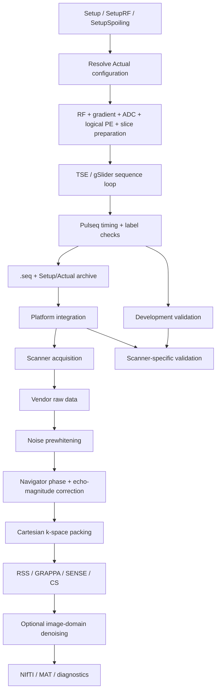

# TSE Pulseq architecture

`tse-pulseq-matlab` separates the reusable TSE acquisition model from scanner-specific execution and raw-data handling. This distinction is central to both the code and the documentation: **Pulseq is the portability layer; scanner integration and validation remain explicit platform responsibilities.**

## Core layers

### Acquisition design

The maintained sequence entry points are `TSE_2D.m` and `TSE_2D_gSlider.m`. User intent is expressed through `Setup`, `SetupRF`, and `SetupSpoiling`; preparation functions resolve those requests into the `Actual` structure, Pulseq events, logical phase encoding, slice order, timing, and exported definitions.

The acquisition layer should describe TSE physics and sampling without depending on a vendor raw-data format. The most important reusable concepts are echo-train timing, effective-TE placement, RF/refocusing schedules, gradient moments, phase-encoding order, acceleration pattern, and slice acquisition order.

### Platform integration

A `.seq` file still has to be executed by a real scanner. Platform integration provides hardware limits, raster/dead-time assumptions, interpreter behavior, logical-to-physical axis mapping, safety/PNS models, and any metadata required by the scanner's online reconstruction.

The current repository is **not fully vendor-decoupled**. The implemented system profiles are Siemens Terra variants, accelerated PI currently contains Siemens LIN mapping, PNS development checks use Siemens `.asc` models, and several sequence definitions participate in the current Siemens interpreter/ICE contract. These boundaries are documented in [Platform Integration](/platform-integration).

### Reconstruction and correction

The bundled MATLAB reconstruction currently targets conventional Cartesian 2D TSE Siemens Twix data through `mapVBVD`. Its processing order is intentionally explicit: noise prewhitening precedes navigator estimation; phase and echo-magnitude corrections are applied consistently to imaging and calibration streams; encoded rows are packed from MDH labels; reconstruction then selects RSS, diagnostic PE-GRAPPA, ESPIRiT-SENSE, or Cartesian CS.

The reconstruction model is separate from the raw-data reader. A future vendor-specific reader should map its native data and metadata into the same reconstruction abstractions instead of leaking raw-data assumptions back into the sequence design.

### Validation

Validation evidence is hierarchical. Pulseq timing and label checks establish software consistency; internal forward/adjoint and calibration checks establish reconstruction consistency; phantom studies test geometry and image behavior; scanner-side RF/SAR, gradient/PNS, interpreter, watchdog, and protocol checks determine whether a specific platform is acceptable for acquisition.

A successful Siemens 7 T test therefore does not automatically validate another scanner model or vendor.

## Current implementation status

| Layer | Current status |
| --- | --- |
| Acquisition goal | Vendor-neutral Cartesian 2D TSE and gSlider-TSE design in Pulseq |
| Sequence implementation | MATLAB + Pulseq, with some Siemens-specific integration still in shared preparation code |
| Scanner presets | `Terra-XJ`, `Terra-XR` |
| Scanner validation | Siemens 7 T |
| Online integration | Siemens interpreter / LIN / iPAT / ICE metadata path |
| Offline raw-data reader | Siemens Twix through `mapVBVD` |
| Offline reconstruction | RSS, diagnostic PE-GRAPPA, ESPIRiT-SENSE, Cartesian CS |
| Echo corrections | Navigator-based constant + readout-linear phase; optional echo-magnitude equalization |
| Post-processing | Optional NLM, BM3D, SANLM, and TGV2 benchmarking workflow |
| gSlider decoding | Not currently implemented in the bundled offline reconstruction |

## Where to go next

For the mathematical abstraction, read [Symbols & notation](/theory/symbols), [TSE echo-train model](/theory/tse-echo-train), and [Phase encoding & effective TE](/theory/phase-encoding). For implementation, continue with [Sequence Generation](/sequence-generation). For scanner coupling, use [Platform Integration](/platform-integration) and [Siemens 7 T LIN & ICE](/phase-encoding-and-ice). For data processing, continue with [Reconstruction](/reconstruction) and [Echo Corrections](/guide/echo-corrections).
