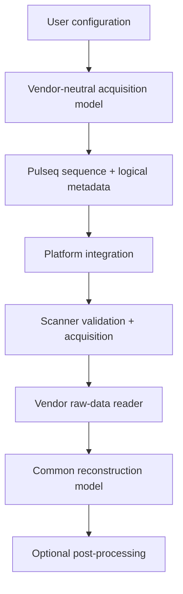

# Developer guide

This page describes the repository architecture and the conventions that should be preserved when extending sequence generation, platform integration, reconstruction, or documentation.

## Repository layout

```text
TSE_2D.m               conventional 2D TSE entry point
TSE_2D_gSlider.m       gSlider-TSE entry point
prep/                   sequence preparation modules
check/                  timing, label and PNS development checks
plot/                   sequence and k-space visualization
utils/                  raster-aware gradient solvers and general utilities
pulseq/                 Pulseq git submodule
VERSE/                  VERSE/minimum-SAR RF git submodule
recon/matlab/           conventional 2D TSE MATLAB reconstruction
recon/julia/            Julia-side reconstruction code retained by the project
seq/                     generated sequence/configuration outputs; not tracked
docs/                    VitePress documentation source
.github/workflows/       CI and documentation deployment workflows
```

## Target architecture

The long-term design should keep reusable acquisition logic separate from platform-specific implementation.



::: warning Current implementation
This is a target separation of concerns, not a claim that the current code is already vendor-decoupled. `prep_System` currently supports Terra profiles, accelerated PI includes Siemens LIN mapping, `prep_Definition` writes Siemens-oriented interpreter definitions, the development PNS path uses Siemens `.asc` files, and the bundled raw-data reader is Twix-specific.
:::

Use [Architecture](/concepts-overview) and [Platform Integration](/platform-integration) as the public specification of this boundary.

## Preserve `Setup` versus `Actual`

`Setup`, `SetupRF`, and `SetupSpoiling` represent requested configuration. `Actual` is the resolved configuration after preparation.

New derived timing, hardware, PE, slice, RF, or export values should normally be written to `Actual` rather than changing the semantic meaning of the original user-facing field. This distinction is essential for reproducibility and for debugging platform-specific behavior.

## Gradient design rules

The custom gradient utilities treat a continuous analytical solution as a seed rather than as the scanner waveform.

Every returned waveform must be validated on the integer gradient raster against:

- requested gradient area;
- exact rasterized duration;
- initial and final amplitudes;
- gradient-amplitude limit;
- slew-rate limit.

Do not replace the raster-aware search with a continuous solution followed by naive rounding. For non-zero endpoints, fixed-duration feasibility can be non-monotonic, so a simple binary search is not a proof of the discrete minimum duration.

Hardware limits must correspond to the selected scanner target. The current Terra profiles are implementation presets, not generic defaults for all Pulseq systems.

## Crusher and spoiler conventions

Crusher/spoiler strength is expressed as dephasing cycles per physical reference length through `SetupSpoiling` and `prep_SpoilingArea`.

Supported references include `Slice`, `RO`, `PE`, `3D`, and `Slab`. New spoiler behavior should reuse this convention instead of embedding hard-coded gradient areas in a sequence loop.

This keeps the physical meaning stable when FOV, resolution, slice thickness, or slab geometry changes.

## Logical encoding before platform metadata

Keep the following sequence concepts vendor-independent where practical:

- signed logical $k_y$ order;
- echo-to-$k_y$ assignment;
- full encoded matrix size;
- physical k-space center;
- PI/CS sampling intent;
- ACS/reference intent;
- slice acquisition order.

The target scanner adapter may then map those quantities to platform-specific line numbers and metadata.

For the current Siemens 7 T path, preserve the documented zero-based PI LIN mapping, regular acceleration-lattice checks, full matrix export, ACS bookkeeping, and interpreter definitions. For another platform, define its mapping deliberately instead of copying Siemens semantics.

CS and PI should remain distinct acquisition modes. Do not silently apply online PI/ICE line conventions to CS data intended for offline iterative reconstruction.

## gSlider-specific development

Shared conventional/gSlider behavior belongs in common preparation functions. gSlider-specific encoding and repetition behavior belongs in the dedicated gSlider sequence loops unless the common abstraction is genuinely identical.

Changes to gSlider excitation or TRAPS schedules should be reviewed for peak B1, slice profile, echo-envelope behavior, SAR, and reconstruction implications. The current bundled offline reconstruction does not decode gSlider data.

## Reconstruction architecture

`recon_TSE2D.m` orchestrates a transparent pipeline:

```text
read Siemens Twix
  -> prewhiten
  -> estimate/apply navigator corrections
  -> pack Cartesian k-space
  -> RSS / GRAPPA / SENSE / CS
  -> save geometry + diagnostics
```

The vendor raw-data reader and the reconstruction model should remain conceptually separate. If another raw-data format is added, translate its data and metadata into the common reconstruction representation rather than introducing raw-data assumptions into sequence-generation code.

SENSE and CS intentionally share one Cartesian multicoil forward/adjoint model and one calibration/sensitivity preparation path. New iterative methods should reuse those tested operators when the physical encoding model is unchanged.

## Numerical safeguards

Do not remove validation checks merely to make a dataset execute. Important current safeguards include:

- warning/fallback for missing noise data;
- navigator requirements for echo-magnitude correction;
- GRAPPA calibration diagnostics;
- contiguous-ACS checks for ESPIRiT;
- forward/adjoint inner-product tests for SENSE/CS;
- primal-dual step-size checks;
- NIfTI geometry consistency checks.

If a safeguard rejects a legitimate new acquisition, update the model, validation logic, and tests together rather than disabling the check globally.

## Documentation architecture

The public documentation intentionally mirrors the project architecture and now follows the same VitePress organization used by `HighOrderMRI.jl`:

- **Getting Started** — installation, runnable examples, architecture overview;
- **Theory** — symbols, TSE echo-train model, phase encoding/effective TE;
- **Sequence Design** — implementation workflow, gSlider/TRAPS, parameters;
- **Platform Integration** — portability boundary and current Siemens LIN/ICE contract;
- **Reconstruction** — raw-data workflow, echo corrections, denoising;
- **Validation** — scanner-independent principles and platform-specific phantom SOP;
- **Reference** — reproducibility, developer guidance, literature;
- **Support** — troubleshooting.

When behavior changes, update the page belonging to the affected layer rather than duplicating caveats across every page. Use cross-links from workflow pages to the dedicated theory or algorithm page.

Mathematical derivations should use MathJax-compatible Markdown. Architecture and processing-flow figures can use Mermaid fenced blocks. Avoid putting LaTeX inside Mermaid labels; keep exact mathematical notation in the surrounding document.

## Build documentation locally

Install the pinned dependencies from the repository root:

```bash
npm install
```

Run a development server:

```bash
npm run docs:dev
```

Build the production site:

```bash
npm run docs:build
```

The documentation stack is pinned to the same VitePress 2 alpha generation, Mermaid version, and MathJax dependency used by the reference `HighOrderMRI.jl` documentation branch.

## GitHub Pages deployment

`.github/workflows/docs.yml` builds the site and deploys `docs/.vitepress/dist` through GitHub Pages Actions for documentation changes merged to `main`.

The expected project Pages URL is

```text
https://bennyzhang-codes.github.io/tse-pulseq-matlab/
```

Repository Pages settings should use **GitHub Actions** as the publishing source.

## Pull-request expectations

A PR that changes sequence or reconstruction behavior should document:

- motivation and user-visible behavior;
- mathematical/algorithmic change when relevant;
- acquisition versus platform-integration implications;
- validation performed;
- known limitations;
- scanner-side validation still required.

Update the corresponding documentation page whenever a public configuration field, output convention, reconstruction option, validation claim, or platform-support statement changes.

## Release discipline

Before a citation-oriented release:

1. run the maintained sequence examples and available reconstruction tests;
2. record Pulseq and VERSE submodule revisions;
3. update documentation and platform-support statements;
4. update `CITATION.cff` with release metadata;
5. create a fixed tag/release;
6. archive the release through Zenodo when appropriate;
7. use the assigned version-specific DOI for work based on that release.

See [Reproducibility & Citation](/reproducibility).
