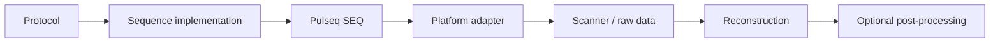

# Developer guide

This page defines the engineering and documentation conventions to preserve when extending sequence generation, scanner integration, reconstruction, validation or third-party method support.

## Repository layout

```text
TSE_2D.m               conventional 2D TSE entry point
TSE_2D_gSlider.m       gSlider-TSE entry point
prep/                   sequence preparation, RF assets and PE sampling
check/                  timing, label and PNS development checks
plot/                   sequence and k-space visualization
utils/                  raster-aware gradient and shared sequence utilities
pulseq/                 Pulseq Git submodule
VERSE/                  VERSE Git submodule
recon/matlab/           conventional 2D TSE MATLAB reconstruction
recon/julia/            retained Julia reconstruction code
seq/                     generated sequence/configuration outputs
docs/                    VitePress documentation source
.github/workflows/       CI and documentation deployment workflows
```

## Engineering separation of concerns

The desired long-term architecture is



This is a target separation, not a claim that the current implementation is already vendor-decoupled. Current Siemens-specific coupling is documented in [Repository Architecture](/concepts-overview) and [Platform Integration](/platform-integration).

## Preserve `Setup` versus `Actual`

`Setup`, `SetupRF` and `SetupSpoiling` express requested user configuration. `Actual` contains the resolved implementation after timing/raster/system/PE preparation.

New derived timing, hardware, PE, RF, slice or exported values should normally be added to `Actual` rather than silently changing the meaning of a user-facing field. Save both structures with the generated `.seq` for reproducibility.

## Logical acquisition before platform metadata

Where practical, keep these concepts platform-independent:

- logical signed $k_y$;
- echo-to-$k_y$ assignment;
- full encoded matrix size;
- k-space center;
- PI/CS sampling intent;
- ACS/reference intent;
- slice acquisition order.

A platform adapter can then map them to vendor-specific counters/metadata. Siemens LIN is one current adapter convention; it should not become the internal definition of PE position.

## Gradient design rules

Custom gradient utilities must validate the **discrete rasterized waveform**, not only a continuous analytical solution. Check

- requested area;
- exact duration;
- initial/final amplitude;
- maximum gradient; and
- maximum slew.

Do not replace raster-aware search with continuous optimization followed by naive rounding. Hardware limits must belong to the selected target system rather than be treated as global defaults.

## Crusher / spoiler convention

Spoiler strength is expressed as dephasing cycles divided by a physical reference length through `SetupSpoiling`. Reuse this convention (`Slice`, `RO`, `PE`, `3D`, `Slab`) instead of embedding fixed gradient areas inside new sequence loops.

## Adding or changing a sampling algorithm

Sampling code is scientifically visible sequence behavior. A contribution that changes PI or CS sampling must document

1. the actual mask geometry (1D PE, 2D, Cartesian/non-Cartesian, etc.);
2. target sample count / acceleration definition;
3. randomization and seed behavior;
4. ACS/fully sampled center handling;
5. ordering into the TSE echo train;
6. source code provenance; and
7. the primary scientific method citation.

The current CS path is explicitly documented as the Lustig-derived SparseMRI polynomial variable-density + Monte-Carlo interference-minimization implementation [[8]](/references#ref-8 "Lustig M, Donoho D, Pauly JM. Sparse MRI: the application of compressed sensing for rapid MR imaging. Magn Reson Med. 2007;58:1182-1195."). Preserve retained copyright/source headers in `prep/CS/`.

## Adding or regenerating RF pulses

Do not add a generated RF `.mat` file without recording how it was produced. For each pulse bank document

- generator/toolbox and version where possible;
- script/notebook path;
- design method citation;
- input design parameters; and
- whether the generator is required at runtime.

The current SLR and gSlider banks are generated by `prep/pulse/RF_pulse.ipynb` using SigPy RF, with SLR [[20]](/references#ref-20 "Pauly JM, Le Roux P, Nishimura DG, Macovski A. Parameter relations for the Shinnar-Le Roux selective excitation pulse design algorithm. IEEE Trans Med Imaging. 1991;10:53-65.") and gSlider [[21]](/references#ref-21 "Setsompop K, Fan Q, Stockmann J, et al. High-resolution in vivo diffusion imaging of the human brain with generalized slice dithered enhanced resolution: simultaneous multislice (gSlider-SMS). Magn Reson Med. 2018;79:141-151.") method citations.

## Third-party and adapted code provenance

Every externally derived component should distinguish three levels:

1. **scientific method** — original/primary method publication;
2. **software/code source** — upstream repository/toolbox/copyright header;
3. **repository adaptation** — what this project changed, wrapped or generated.

Do not call adapted code an independent implementation. Conversely, do not imply that repository-local code came from an upstream toolbox merely because both follow the same paper.

The canonical package-wide map is [Dependencies & Method Provenance](/reference/provenance). Update it whenever a public algorithm/tool/dependency changes.

## gSlider / TRAPS development

Shared behavior belongs in common preparation functions; gSlider-specific encoding belongs in gSlider-specific loops unless the abstraction is genuinely common.

`utils/fliptraps.m` is documented as a repository implementation of the TRAPS concept [[22]](/references#ref-22 "Hennig J, Weigel M, Scheffler K. Multiecho sequences with variable refocusing flip angles: optimization of signal behavior using smooth transitions between pseudo steady states (TRAPS). Magn Reson Med. 2003;49:527-535."), not as original distributed TRAPS source code.

Changes to gSlider/refocusing schedules require review of RF profile, B1, stimulated-echo behavior, SAR and reconstruction implications. The current bundled reconstruction does not decode gSlider.

## Reconstruction architecture

`recon_TSE2D.m` orchestrates

```text
Twix/mapVBVD
→ prewhitening
→ navigator correction
→ optional echo-envelope gain
→ Cartesian packing
→ coil calibration
→ RSS / GRAPPA / SENSE / CS
→ geometry / diagnostics
```

The raw-data reader should stay separate from the numerical encoding model. A future vendor-specific reader should map its native data/metadata into the common representation rather than introducing vendor assumptions into sequence generation.

SENSE and CS share one tested Cartesian $PFS$ operator and sensitivity/calibration path. Reuse the operator when the physical encoding model is unchanged.

## Optional processing contract

Optional methods must remain explicit:

- `EchoMagnitudeCorrection=false` is the default; users opt into navigator-derived envelope equalization.
- NLM/BM3D/SANLM/TGV2 are post-reconstruction functions and are not automatically called by `recon_TSE2D`.

Do not change an optional method into an implicit default without documentation, validation, compatibility review and a clear reason.

## Numerical safeguards

Do not remove checks merely to make one dataset run. Current examples include

- warning/fallback for missing noise data;
- navigator requirements when an echo correction is requested;
- GRAPPA calibration diagnostics;
- ESPIRiT ACS checks;
- SENSE/CS forward-adjoint identity tests;
- primal-dual stability checks; and
- NIfTI geometry checks.

If a legitimate new acquisition violates an assumption, update the model, checks, tests and documentation together.

## Documentation architecture

The website is **engineering documentation for an open-source sequence package**, not a reconstruction-library API manual and not a standalone MRI Methods manuscript.

The primary organization is

```text
Getting Started
→ Sequence Implementation
→ Reconstruction
→ Validation & Safety
→ Reference & Provenance
→ Support
```

Theory appears next to the implementation that needs it:

- TSE echo physics and effective TE are under **Sequence Implementation**;
- PI/CS sampling theory is next to the PE implementation;
- SENSE/CS equations are inside **Reconstruction**;
- optional echo correction and denoising each have their own implementation page.

Avoid duplicating the same principle in separate “Theory” and “API” chapters when one engineering page can clearly present **purpose → implementation → equations → options → source**.

## Citation convention — match HighOrderMRI

All scientific citations in VitePress prose should use the HighOrderMRI interaction pattern:

```md
[[8]](/references#ref-8 "Lustig M, Donoho D, Pauly JM. Sparse MRI: the application of compressed sensing for rapid MR imaging. Magn Reson Med. 2007;58:1182-1195.")
```

Requirements:

- visible text is the MRM-style number `[8]`;
- link target is `/references#ref-8`;
- the Markdown link `title` contains enough bibliographic text to make the hover tooltip useful;
- the numbered References page uses **one continuous `<ol>`**;
- each item has a stable `id="ref-n"`;
- DOI text on the References page must be a clickable `https://doi.org/...` link;
- use the primary scientific citation for the method, while code/tool provenance is documented separately when applicable.

The existing theme CSS renders `title` as the hover tooltip and highlights the targeted reference after navigation. Do not introduce a second citation widget unless this mechanism can no longer meet the requirement.

## Reference-list rules

The public bibliography contains scientific publications, not internal design notes or private vendor manuals. Software/code provenance belongs under [Dependencies & Method Provenance](/reference/provenance), with scientific papers linked back into the numbered reference list.

When adding a reference:

1. verify authors/title/journal/year/pages;
2. verify DOI against a primary/authoritative bibliographic source where available;
3. add one numbered `<li id="ref-n">`;
4. make DOI clickable;
5. use the same reference number consistently throughout the site.

## Mermaid conventions

Use Mermaid for conceptual/implementation flow, not detailed equations.

- short labels;
- equations remain in MathJax prose;
- transparent background / light styling;
- no decorative heavy borders/animation;
- wide diagrams keep natural width and scroll horizontally;
- small diagrams are enlarged by `MermaidDiagram.vue` so they do not render as unreadable thumbnails;
- globally unique Mermaid render IDs must remain enabled.

When adding a new diagram, inspect both desktop and narrow layouts. Do not solve a wide diagram by globally shrinking SVG to the article width.

## Validation before performance claims

Keep the evidence hierarchy explicit:

```text
implementation consistency
→ independent numerical/algorithm validation where relevant
→ phantom / physical validation
→ platform safety validation
→ performance reporting
```

A forward/adjoint self-check is not physical validation. A visually sharper optional correction is not automatically more accurate. A runtime number without a frozen protocol/hardware scope is not a reusable performance claim.

See [Validation Strategy](/validation/scientific-validation), [Reconstruction Protocol](/validation/reconstruction-protocol) and [Performance & Benchmarking](/validation/performance-benchmarking).

## Documentation build

From the repository root:

```bash
npm install
npm run docs:dev
npm run docs:build
```

GitHub Actions builds and deploys `docs/`; generated Pages output is not hand-edited.

## Pull-request expectations

A PR changing sequence/reconstruction behavior should state

- user-visible behavior;
- affected source paths;
- scientific method/source provenance if new;
- acquisition/platform implications;
- validation performed;
- optional/default behavior changes; and
- known limitations / scanner work still required.

Update public documentation and References/Provenance in the same PR when a user-visible algorithm or dependency changes.

## README / release consistency

README and website must agree on

- sequence scope;
- platform-validation boundary;
- current raw-data/reconstruction support;
- optional processing defaults;
- dependency/provenance statements;
- documentation URL; and
- release/version status.

Before a citation-oriented release, freeze/record the relevant submodule revisions, generated RF assets/configuration, reconstruction settings, references and provenance. See [Reproducibility & Citation](/reproducibility).
