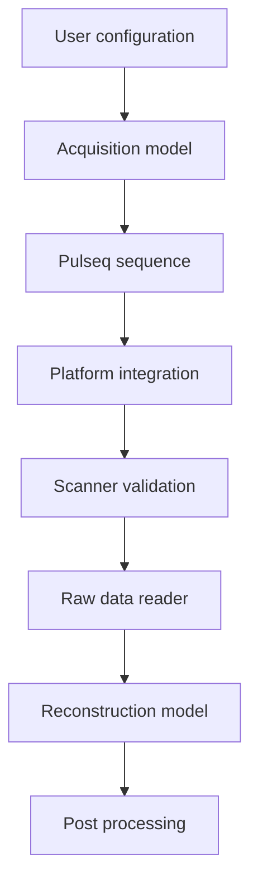

# Developer guide

This page describes the repository architecture and the conventions that should be preserved when extending sequence generation, platform integration, reconstruction, validation, or documentation.

## Repository layout

```text
TSE_2D.m               conventional 2D TSE entry point
TSE_2D_gSlider.m       gSlider-TSE entry point
prep/                   sequence preparation modules
check/                  timing, label and PNS development checks
plot/                   sequence and k-space visualization
utils/                  raster-aware gradient solvers and general utilities
pulseq/                 Pulseq git submodule
VERSE/                  VERSE/minimum-SAR RF git submodule
recon/matlab/           conventional 2D TSE MATLAB reconstruction
recon/julia/            Julia-side reconstruction code retained by the project
seq/                     generated sequence/configuration outputs; not tracked
docs/                    VitePress documentation source
.github/workflows/       CI and documentation deployment workflows
```

## Target architecture

The long-term design should keep reusable acquisition logic separate from platform-specific implementation.



::: warning Current implementation
This is a target separation of concerns, not a claim that the current code is already vendor-decoupled. `prep_System` currently supports Terra profiles, accelerated PI includes Siemens LIN mapping, `prep_Definition` writes Siemens-oriented interpreter definitions, the development PNS path uses Siemens `.asc` files, and the bundled raw-data reader is Twix-specific.
:::

Use [Architecture](/concepts-overview) and [Platform Integration](/platform-integration) as the public specification of this boundary.

## Preserve `Setup` versus `Actual`

`Setup`, `SetupRF`, and `SetupSpoiling` represent requested configuration. `Actual` is the resolved configuration after preparation.

New derived timing, hardware, PE, slice, RF, or export values should normally be written to `Actual` rather than changing the semantic meaning of the original user-facing field. This distinction is essential for reproducibility and for debugging platform-specific behavior.

## Gradient design rules

The custom gradient utilities treat a continuous analytical solution as a seed rather than as the scanner waveform.

Every returned waveform must be validated on the integer gradient raster against:

- requested gradient area;
- exact rasterized duration;
- initial and final amplitudes;
- gradient-amplitude limit; and
- slew-rate limit.

Do not replace the raster-aware search with a continuous solution followed by naive rounding. For non-zero endpoints, fixed-duration feasibility can be non-monotonic, so a simple binary search is not a proof of the discrete minimum duration.

Hardware limits must correspond to the selected scanner target. The current Terra profiles are implementation presets, not generic defaults for all Pulseq systems.

## Crusher and spoiler conventions

Crusher/spoiler strength is expressed as dephasing cycles per physical reference length through `SetupSpoiling` and `prep_SpoilingArea`.

Supported references include `Slice`, `RO`, `PE`, `3D`, and `Slab`. New spoiler behavior should reuse this convention instead of embedding hard-coded gradient areas in a sequence loop.

This keeps the physical meaning stable when FOV, resolution, slice thickness, or slab geometry changes.

## Logical encoding before platform metadata

Keep the following sequence concepts vendor-independent where practical:

- signed logical $k_y$ order;
- echo-to-$k_y$ assignment;
- full encoded matrix size;
- physical k-space center;
- PI/CS sampling intent;
- ACS/reference intent; and
- slice acquisition order.

The target scanner adapter may then map those quantities to platform-specific line numbers and metadata.

For the current Siemens 7 T path, preserve the documented zero-based PI LIN mapping, regular acceleration-lattice checks, full matrix export, ACS bookkeeping, and interpreter definitions. For another platform, define its mapping deliberately instead of copying Siemens semantics.

CS and PI should remain distinct acquisition modes. Do not silently apply online PI/ICE line conventions to CS data intended for offline iterative reconstruction.

## gSlider-specific development

Shared conventional/gSlider behavior belongs in common preparation functions. gSlider-specific encoding and repetition behavior belongs in the dedicated gSlider sequence loops unless the common abstraction is genuinely identical.

Changes to gSlider excitation or TRAPS schedules should be reviewed for peak B1, slice profile, echo-envelope behavior, SAR, and reconstruction implications. The current bundled offline reconstruction does not decode gSlider data.

## Reconstruction architecture

`recon_TSE2D.m` orchestrates a transparent pipeline:

```text
read Siemens Twix
→ prewhiten
→ estimate/apply navigator corrections
→ pack Cartesian k-space
→ prepare coil model
→ RSS / GRAPPA / SENSE / CS
→ save geometry + diagnostics
```

The vendor raw-data reader and the reconstruction model should remain conceptually separate. If another raw-data format is added, translate its data and metadata into the common reconstruction representation rather than introducing raw-data assumptions into sequence-generation code.

SENSE and CS intentionally share one Cartesian multicoil forward/adjoint model and one calibration/sensitivity preparation path. New iterative methods should reuse those tested operators when the physical encoding model is unchanged.

## Numerical safeguards

Do not remove validation checks merely to make a dataset execute. Important current safeguards include:

- warning/fallback for missing noise data;
- navigator requirements for echo-magnitude correction;
- GRAPPA calibration diagnostics;
- contiguous-ACS checks for ESPIRiT;
- forward/adjoint inner-product tests for SENSE/CS;
- primal-dual step-size checks; and
- NIfTI geometry consistency checks.

If a safeguard rejects a legitimate new acquisition, update the model, validation logic, and tests together rather than disabling the check globally.

## Documentation architecture

The documentation is intended to behave like an MRI Methods companion site rather than a collection of code notes.

The preferred scientific reading order is

```text
physics / signal model
→ discrete encoding
→ matrix formulation
→ explicit sequence implementation
→ reconstruction workflow
→ scientific validation
→ performance
→ API / troubleshooting
```

The main responsibilities are therefore separated as follows:

- **Getting Started** — installation, runnable examples, local documentation build, reading paths;
- **Theory** — symbols, continuous/discrete TSE model, matrix encoding, PE/effective-TE interpretation;
- **Sequence Design** — implementation workflow, gSlider/TRAPS, parameters, platform boundary;
- **Reconstruction** — full measured-data-to-image processing chain;
- **Validation & Performance** — evidence hierarchy, frozen comparison protocol, scanner safety, phantom SOP, benchmarking contract;
- **Reference** — API lookup, source links, reproducibility, literature;
- **Support** — troubleshooting and engineering compatibility issues.

Theory pages answer **why**. API pages answer **how to call it**. Validation pages answer **what evidence supports the claim**. Do not duplicate long derivations across these layers.

## Theory-writing conventions

A scientific encoding page should normally follow

```text
continuous signal model
→ discrete formulation
→ matrix formulation
→ explicit implementation
→ approximation / reconstruction method
→ implementation conventions
```

Do not start a Theory page with MATLAB array dimensions or internal variable names. Introduce them only after the physical and matrix models are defined.

The common symbols, units, phase convention, and index meanings belong in [Symbols & notation](/theory/symbols).

## Mermaid conventions

Use Mermaid for **conceptual flow**, not mathematical typesetting.

- keep node labels to ordinary English/ASCII when possible;
- keep exact symbols/equations in MathJax prose below the figure;
- use transparent backgrounds and light/no borders;
- avoid thick outlines, glassmorphism, heavy animation, or decorative effects;
- keep diagrams at natural SVG size and allow horizontal scrolling rather than shrinking a wide scientific diagram until text becomes unreadable;
- ensure render IDs are globally unique when multiple diagrams appear on one page.

The current `MermaidDiagram.vue` uses a module-level render serial and a horizontally scrollable natural-size SVG container for these reasons.

## Code-fence conventions

Fence languages should describe the actual content:

- MATLAB code → `matlab`;
- shell commands → `bash`;
- Mermaid diagrams → `mermaid`;
- native logs / stack traces → `text`.

Do not turn a stack trace into a Mermaid figure simply because it contains arrows or indentation.

## References and claims

Scientific method pages should use numbered citations linked to `/references#ref-n`. References use MRM-like journal abbreviations and verified DOI metadata where available.

Do not mix internal design logs, private vendor manuals, CI logs, or Notion notes into the public scientific reference list. Vendor-specific integration documentation can be acknowledged separately when it is needed to explain implementation behavior.

## Validation before performance

The documentation order is intentional:

```text
implementation consistency
→ approximation accuracy
→ independent numerical validation
→ physical validation
→ performance
```

A successful forward/adjoint self-check should not be promoted as independent physical validation. Likewise, a runtime benchmark should not be promoted until the reconstruction protocol, accuracy target, and hardware/timing scope are frozen.

See [Scientific validation strategy](/validation/scientific-validation), [Reconstruction protocol](/validation/reconstruction-protocol), and [Performance & benchmarking](/validation/performance-benchmarking).

## Build documentation locally

Install the pinned dependencies from the repository root:

```bash
npm install
```

Run a development server:

```bash
npm run docs:dev
```

Build the production site:

```bash
npm run docs:build
```

The site uses VitePress with MathJax and a custom Mermaid component.

## GitHub Pages deployment

`.github/workflows/docs.yml` performs

```text
install documentation dependencies
→ VitePress production build
→ configure GitHub Pages
→ upload Pages artifact
→ deploy
```

`main` is the production source branch. During the current documentation redesign, `vitepress-style` is also configured as a source branch and deploys through a separate preview environment. The generated Pages output should not be edited manually.

The site URL is

```text
https://bennyzhang-codes.github.io/tse-pulseq-matlab/
```

A green build is necessary but not a complete visual check. Mermaid is client-side hydrated, so generated SSR HTML may contain the component container before an SVG exists. Final review should therefore include opening the deployed browser page and checking equations, diagrams, navigation, and mobile overflow.

## Pull-request expectations

A PR that changes sequence or reconstruction behavior should document

- motivation and user-visible behavior;
- mathematical/algorithmic change when relevant;
- acquisition versus platform-integration implications;
- validation performed and its evidence level;
- known limitations; and
- scanner-side validation still required.

Update the corresponding documentation page whenever a public configuration field, output convention, reconstruction option, validation claim, or platform-support statement changes.

## README consistency

The README and website should agree on

- Cartesian/gSlider scope;
- portable design goal versus validated scanner platform;
- reconstruction/raw-data support;
- documentation URL;
- validation claims; and
- release/version status.

A documentation architecture change is incomplete until the README is checked against it.

## Release discipline

Before a citation-oriented release:

1. run the maintained sequence examples and available reconstruction tests;
2. record Pulseq and VERSE submodule revisions;
3. freeze the relevant reconstruction/validation protocol;
4. update documentation and platform-support statements;
5. update `CITATION.cff` with release metadata;
6. create a fixed tag/release;
7. archive the release through Zenodo when appropriate; and
8. use the assigned version-specific DOI for work based on that release.

Do not fabricate a `stable` documentation version before the repository actually has a corresponding release/tag.

See [Reproducibility & Citation](/reproducibility).
