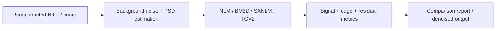

# Image-domain denoising

The `recon/matlab/denoising/` module provides **optional post-reconstruction denoising and benchmarking**. It is not called automatically by the Twix reconstruction pipeline and should not be treated as a substitute for acquisition-side echo-envelope optimization or a well-conditioned reconstruction.

## Available methods

| Method | Implementation | Intended role |
| --- | --- | --- |
| NLM | MATLAB workflow through `denoise_TSE2D.m` | Simple non-local baseline |
| BM3D | Optional external BM3D 4.x dependency | Correlated-noise-aware comparison |
| SANLM | Optional CAT12 dependency | Additional adaptive non-local comparison |
| TGV2 | Repository-local `denoise_TGV2.m` | Transparent variational MRI denoising baseline |

The common wrapper is

```text
recon/matlab/denoising/denoise_TSE2D.m
```

Noise estimation, benchmarking, and quantitative diagnostics are implemented separately so that denoising strength can be evaluated rather than selected by visual preference alone.

## Workflow



Relevant utilities include:

```text
estimate_TSE2D_image_noise.m
measure_TSE2D_denoising.m
benchmark_TSE2D_denoisers.m
```

## Colored-noise estimation

Acceleration and reconstruction can produce spatially correlated noise. The benchmark estimates a stationary background noise power spectral density (PSD) after detrending selected background patches.

The PSD normalization is checked against

$$
\frac{1}{N}\sum_k\Phi(k)=\sigma^2,
$$

where $\Phi(k)$ is the estimated discrete noise PSD and $\sigma^2$ is the corresponding image-domain noise variance.

A single stationary PSD remains an approximation: spatially varying g-factor noise from GRAPPA or SENSE cannot in general be represented by one global spectrum.

## Second-order TGV

The repository-local TGV2 implementation solves the standard TGV-L2 model

$$
\min_{u,w}
\frac12\lVert u-f\rVert_2^2
+
\alpha_1\lVert\nabla u-w\rVert_{2,1}
+
\alpha_0\lVert Ew\rVert_{F,1},
$$

where $f$ is the input image, $u$ is the denoised image, $w$ is an auxiliary vector field, and $E$ is the symmetrized gradient. The solver uses a conservative Chambolle-Pock primal-dual iteration with matched discrete adjoints and zero-Neumann boundaries.

See [Knoll et al.](/references#ref-tgv "Knoll et al., Second order total generalized variation for MRI, MRM 2011") and [Chambolle & Pock](/references#ref-chambolle-pock "Chambolle and Pock, first-order primal-dual algorithm, JMIV 2011") for the underlying methods.

## BM3D and correlated noise

The optional BM3D path uses a separately installed BM3D 4.x package and can supply a two-dimensional background-estimated noise PSD to the correlated-noise interface. The third-party implementation is **not vendored** because its license must be accepted separately.

See [Dabov et al.](/references#ref-bm3d "Dabov et al., BM3D collaborative filtering, IEEE TIP 2007") and [Makinen et al.](/references#ref-bm3d-correlated "Makinen et al., collaborative filtering of correlated noise, IEEE TIP 2020").

## SANLM and anisotropic 2D TSE

The optional CAT12 SANLM integration is primarily a comparison path. For anisotropic multi-slice 2D TSE data, the wrapper can emulate slice-wise 2D processing rather than allowing through-plane averaging across thick or widely spaced slices.

That choice is deliberate: an algorithm validated on nearly isotropic 3D data should not be assumed to behave equivalently on a sparse anisotropic 2D stack. Brain use and other anatomies should be validated separately.

## Benchmark metrics

The repository's denoising benchmark reports complementary quantities rather than one universal score. These include:

- background noise reduction;
- foreground signal retention;
- edge-gradient retention;
- residual edge enrichment;
- lag-one residual correlations;
- PE/RO residual anisotropy;
- negative-value fraction when relevant;
- runtime;
- SSIM to the unfiltered reconstruction as a structure-change indicator.

These are **no-reference trade-off diagnostics** unless a clean reference image is explicitly supplied. High apparent smoothness is not evidence of improved fidelity.

## Practical interpretation

Denoising should be evaluated after the reconstruction itself has been validated. In particular:

1. confirm that phase correction, echo-magnitude correction, PE indexing, and calibration are correct;
2. inspect residual artifacts before applying denoising;
3. choose denoising parameters on representative data rather than a single visually favorable slice;
4. report the method and parameters when images are compared quantitatively;
5. preserve the original reconstruction for reference.

::: warning Information cannot be reconstructed after it is lost
Image-domain denoising can reduce noise-like variation, but it cannot recover spatial resolution or signal that was not encoded in the acquired data. Do not use denoising to conceal an acquisition, calibration, phase-correction, or reconstruction failure.
:::

## Optional dependencies and licenses

BM3D and CAT12 SANLM are installed outside the repository under the Git-ignored `third_party_local` location. Their code and binaries must remain subject to their own licenses. TGV2 has no external runtime dependency.

For exact installation paths and third-party license notes, see `recon/matlab/denoising/THIRD_PARTY_DENOISERS.md` in the repository.
