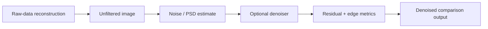

# Optional image-domain denoising

`recon/matlab/denoising/` provides **optional post-reconstruction denoising and benchmarking**. None of these methods are called automatically by `recon_TSE2D`; the unfiltered reconstruction is the output of the core raw-data pipeline.

::: info User-selected post-processing
NLM, BM3D, SANLM and TGV2 are available tools. The package does not select a denoiser on the user's behalf and does not define BM3D or any other denoiser as the standard human-brain reconstruction.
:::

## Available methods and sources

| Method | Concrete implementation | Dependency | Method citation |
| --- | --- | --- | --- |
| NLM | MATLAB `imnlmfilt` through `denoise_TSE2D.m` | Image Processing Toolbox | [[25]](/references#ref-25 "Buades A, Coll B, Morel JM. A non-local algorithm for image denoising. CVPR. 2005;2:60-65.") |
| BM3D | external BM3D 4.x called by `denoise_TSE2D.m` | optional, not vendored | [[11]](/references#ref-11 "Dabov K, Foi A, Katkovnik V, Egiazarian K. Image denoising by sparse 3-D transform-domain collaborative filtering. IEEE Trans Image Process. 2007;16:2080-2095.") |
| correlated-noise BM3D | BM3D interface receives an estimated 2D PSD | optional, not vendored | [[12]](/references#ref-12 "Mäkinen Y, Azzari L, Foi A. Collaborative filtering of correlated noise: exact transform-domain variance for improved shrinkage and patch matching. IEEE Trans Image Process. 2020;29:8339-8354.") |
| SANLM | external CAT12 `cat_sanlm` | optional, not vendored | [[13]](/references#ref-13 "Manjón JV, Coupé P, Martí-Bonmatí L, Collins DL, Robles M. Adaptive non-local means denoising of MR images with spatially varying noise levels. J Magn Reson Imaging. 2010;31:192-203.") |
| TGV2 | repository-local `denoise_TGV2.m` | no external runtime code | [[10]](/references#ref-10 "Knoll F, Bredies K, Pock T, Stollberger R. Second order total generalized variation (TGV) for MRI. Magn Reson Med. 2011;65:480-491.") |

The common wrapper is

```text
recon/matlab/denoising/denoise_TSE2D.m
```

## Processing position



Denoising occurs after k-space reconstruction and is not part of the $PFS$ encoding operator. When a denoised image is used in a figure or analysis, the filtering method and parameters should therefore be reported as post-processing.

## Noise estimation

`estimate_TSE2D_image_noise.m` estimates background noise and a stationary 2D power spectral density after detrending selected background patches. The implementation checks

$$
\frac{1}{N}\sum_k\Phi(k)=\sigma^2,
$$

where $\Phi(k)$ is the discrete PSD and $\sigma^2$ is the associated image-domain variance.

A stationary PSD is an approximation. SENSE/GRAPPA g-factor noise can vary spatially, so a single background PSD cannot represent all image locations.

## NLM

The NLM path calls MATLAB `imnlmfilt`. It is exposed as a simple non-local comparison based on the non-local means framework of Buades et al. [[25]](/references#ref-25 "Buades A, Coll B, Morel JM. A non-local algorithm for image denoising. 2005 IEEE Computer Society Conference on Computer Vision and Pattern Recognition. 2005;2:60-65."). The repository adapts the smoothing strength and search/comparison windows for the TSE wrapper; it does not contain an independent reimplementation of the original NLM algorithm.

## BM3D and correlated noise

The BM3D path calls a separately installed BM3D 4.x package. The original collaborative-filtering method is Dabov et al. [[11]](/references#ref-11 "Dabov K, Foi A, Katkovnik V, Egiazarian K. Image denoising by sparse 3-D transform-domain collaborative filtering. IEEE Trans Image Process. 2007;16:2080-2095.").

When `BM3DColoredNoise=true`, the wrapper supplies the estimated 2D background PSD to a compatible correlated-noise BM3D interface. The transform-domain correlated-noise treatment is based on Mäkinen et al. [[12]](/references#ref-12 "Mäkinen Y, Azzari L, Foi A. Collaborative filtering of correlated noise: exact transform-domain variance for improved shrinkage and patch matching. IEEE Trans Image Process. 2020;29:8339-8354.").

This option does not make BM3D universally optimal for TSE or brain data. Preserve the original unfiltered image and validate filtering behavior for the intended application.

## SANLM

The SANLM path uses external CAT12 `cat_sanlm` and cites the adaptive MRI non-local means method of Manjón et al. [[13]](/references#ref-13 "Manjón JV, Coupé P, Martí-Bonmatí L, Collins DL, Robles M. Adaptive non-local means denoising of MR images with spatially varying noise levels. J Magn Reson Imaging. 2010;31:192-203.").

For anisotropic 2D TSE, the wrapper can use slice-wise processing rather than assuming that through-plane voxel spacing is comparable with the in-plane resolution. A 3D neighborhood that ignores large slice spacing should not be interpreted as physically isotropic processing.

## TGV2

The repository-local TGV2 path solves

$$
\min_{u,w}
\frac12\lVert u-f\rVert_2^2
+
\alpha_1\lVert\nabla u-w\rVert_{2,1}
+
\alpha_0\lVert Ew\rVert_{F,1}.
$$

Its MRI method basis is Knoll et al. [[10]](/references#ref-10 "Knoll F, Bredies K, Pock T, Stollberger R. Second order total generalized variation (TGV) for MRI. Magn Reson Med. 2011;65:480-491."). The numerical solver is a repository implementation of the Chambolle-Pock primal-dual framework [[9]](/references#ref-9 "Chambolle A, Pock T. A first-order primal-dual algorithm for convex problems with applications to imaging. J Math Imaging Vis. 2011;40:120-145.").

## Benchmarking rather than visual preference

`measure_TSE2D_denoising.m` and `benchmark_TSE2D_denoisers.m` report complementary quantities such as

- background-noise reduction;
- foreground signal retention;
- edge-gradient retention;
- residual edge enrichment;
- lag-one residual correlations;
- PE/RO residual anisotropy;
- negative-value fraction;
- runtime; and
- SSIM against the **unfiltered** image as a structure-change indicator.

Unless a clean reference exists, these are trade-off diagnostics rather than proof of improved ground-truth fidelity.

## Reporting when a denoiser is used

Retain the unfiltered reconstruction and record, as applicable,

- method name and software/package version;
- external dependency path/version for BM3D or CAT12;
- estimated noise level/PSD method;
- BM3D profile, colored-noise flag and noise-scale parameter;
- NLM strength/windows;
- SANLM mode/radii;
- TGV strengths, ratio, iteration limit and tolerance.

## Licensing

BM3D and CAT12 SANLM are optional external dependencies and are intentionally not vendored. Their code remains subject to the respective upstream licenses. See `recon/matlab/denoising/THIRD_PARTY_DENOISERS.md` for the maintained installation/licensing notes.

## Source map

| Role | Source |
| --- | --- |
| common denoising wrapper | [`denoise_TSE2D.m`](https://github.com/BennyZhang-Codes/tse-pulseq-matlab/blob/vitepress-style/recon/matlab/denoising/denoise_TSE2D.m) |
| image-noise / PSD estimate | [`estimate_TSE2D_image_noise.m`](https://github.com/BennyZhang-Codes/tse-pulseq-matlab/blob/vitepress-style/recon/matlab/denoising/estimate_TSE2D_image_noise.m) |
| TGV2 solver | [`denoise_TGV2.m`](https://github.com/BennyZhang-Codes/tse-pulseq-matlab/blob/vitepress-style/recon/matlab/denoising/denoise_TGV2.m) |
| metrics | [`measure_TSE2D_denoising.m`](https://github.com/BennyZhang-Codes/tse-pulseq-matlab/blob/vitepress-style/recon/matlab/denoising/measure_TSE2D_denoising.m) |
| batch comparison | [`benchmark_TSE2D_denoisers.m`](https://github.com/BennyZhang-Codes/tse-pulseq-matlab/blob/vitepress-style/recon/matlab/denoising/benchmark_TSE2D_denoisers.m) |

See [Dependencies & method provenance](/reference/provenance) for the package-wide attribution map.
