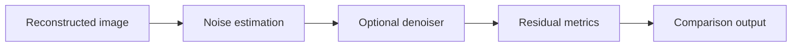

# Image-domain denoising

The `recon/matlab/denoising/` module provides **optional post-reconstruction denoising and benchmarking**. It is not called automatically by the Twix reconstruction pipeline and should not be treated as a substitute for acquisition-side echo-envelope optimization or a well-conditioned reconstruction.

::: info Optional post-processing
Denoising methods in this repository are **available tools, not mandatory reconstruction stages**. `recon_TSE2D` returns the reconstruction without BM3D, NLM, SANLM, or TGV2 unless a user separately calls the denoising module. The package does not select a denoiser on the user's behalf; whether denoising is appropriate depends on the data, noise characteristics, downstream analysis, and reporting requirements.
:::

## Available methods

| Method | Implementation | Role in the package |
| --- | --- | --- |
| NLM | MATLAB workflow through `denoise_TSE2D.m` | Optional non-local baseline |
| BM3D | Optional external BM3D 4.x dependency | Optional collaborative-filtering path with correlated-noise support |
| SANLM | Optional CAT12 dependency | Optional adaptive non-local comparison |
| TGV2 | Repository-local `denoise_TGV2.m` | Optional transparent variational MRI baseline |

The common wrapper is

```text
recon/matlab/denoising/denoise_TSE2D.m
```

Noise estimation, benchmarking, and quantitative diagnostics are implemented separately so that denoising strength can be evaluated rather than selected by visual preference alone.

## Workflow



Relevant utilities include

```text
estimate_TSE2D_image_noise.m
measure_TSE2D_denoising.m
benchmark_TSE2D_denoisers.m
```

## Colored-noise estimation

Acceleration and reconstruction can produce spatially correlated noise. The benchmark estimates a stationary background noise power spectral density (PSD) after detrending selected background patches.

The PSD normalization is checked against

$$
\frac{1}{N}\sum_k\Phi(k)=\sigma^2,
$$

where $\Phi(k)$ is the estimated discrete noise PSD and $\sigma^2$ is the corresponding image-domain noise variance.

A single stationary PSD remains an approximation: spatially varying g-factor noise from GRAPPA or SENSE cannot in general be represented by one global spectrum.

## Second-order TGV

The repository-local TGV2 implementation solves the standard TGV-L2 model

$$
\min_{u,w}
\frac12\lVert u-f\rVert_2^2
+
\alpha_1\lVert\nabla u-w\rVert_{2,1}
+
\alpha_0\lVert Ew\rVert_{F,1},
$$

where $f$ is the input image, $u$ is the denoised image, $w$ is an auxiliary vector field, and $E$ is the symmetrized gradient. The solver uses a conservative Chambolle-Pock primal-dual iteration with matched discrete adjoints and zero-Neumann boundaries.

See [[10]](/references#ref-10 "Knoll et al., Second order TGV for MRI, MRM 2011") and [[9]](/references#ref-9 "Chambolle and Pock, first-order primal-dual algorithm, JMIV 2011") for the underlying methods.

## BM3D and correlated noise

BM3D is exposed as an **optional external denoiser**. The repository does not vendor the third-party BM3D implementation and does not invoke it as part of the standard reconstruction.

The original BM3D method groups similar 2D patches and performs collaborative transform-domain shrinkage [[11]](/references#ref-11 "Dabov et al., BM3D, IEEE TIP 2007"). The optional correlated-noise path can provide a two-dimensional background-estimated noise PSD to a compatible BM3D 4.x interface; the correlated-noise treatment is motivated by the exact transform-domain noise-variance framework of Mäkinen et al. [[12]](/references#ref-12 "Makinen et al., correlated-noise collaborative filtering, IEEE TIP 2020").

These references establish the denoising algorithms; they do **not** imply that BM3D is universally optimal for TSE or for human-brain data. In particular, reconstruction noise may be spatially varying, and a stationary background PSD is only an approximation to g-factor-dependent noise.

If BM3D is used, preserve the original unfiltered reconstruction and report at least the BM3D profile, colored-noise setting, noise-scale parameter, and the method used to estimate the noise PSD.

## SANLM and anisotropic 2D TSE

The optional CAT12 SANLM integration is primarily a comparison path. For anisotropic multi-slice 2D TSE data, the wrapper can emulate slice-wise 2D processing rather than allowing through-plane averaging across thick or widely spaced slices.

That choice is deliberate: an algorithm validated on nearly isotropic 3D data should not be assumed to behave equivalently on a sparse anisotropic 2D stack. Brain use and other anatomies should be validated separately.

See [[13]](/references#ref-13 "Manjon et al., adaptive non-local means MRI denoising, JMRI 2010") for the MRI SANLM method background.

## Benchmark metrics

The repository's denoising benchmark reports complementary quantities rather than one universal score. These include

- background noise reduction;
- foreground signal retention;
- edge-gradient retention;
- residual edge enrichment;
- lag-one residual correlations;
- PE/RO residual anisotropy;
- negative-value fraction when relevant;
- runtime; and
- SSIM to the unfiltered reconstruction as a structure-change indicator.

These are **no-reference trade-off diagnostics** unless a clean reference image is explicitly supplied. High apparent smoothness is not evidence of improved fidelity.

## Practical interpretation

Denoising should be evaluated after the reconstruction itself has been validated. In particular,

1. preserve the original unfiltered reconstruction;
2. confirm that phase correction, optional echo-magnitude correction, PE indexing, and calibration are understood before interpreting denoised results;
3. inspect residual artifacts rather than relying only on visual smoothness;
4. choose denoising parameters on representative data rather than a single favorable slice;
5. report the denoising method and parameters when filtered images enter a quantitative or qualitative comparison.

::: warning Information cannot be reconstructed after it is lost
Image-domain denoising can reduce noise-like variation, but it cannot recover spatial resolution or signal that was not encoded in the acquired data. Do not use denoising to conceal an acquisition, calibration, phase-correction, or reconstruction failure.
:::

## Optional dependencies and licenses

BM3D and CAT12 SANLM are installed outside the repository under the Git-ignored `third_party_local` location. Their code and binaries remain subject to their own licenses. TGV2 has no external runtime dependency.

For exact installation paths and third-party license notes, see `recon/matlab/denoising/THIRD_PARTY_DENOISERS.md` in the repository.
