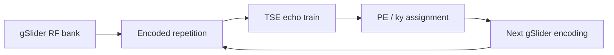

# gSlider-TSE & TRAPS

`TSE_2D_gSlider.m` extends the conventional Cartesian 2D TSE sequence with gSlider RF encoding and an optional TRAPS-style variable refocusing train. This page documents the concrete repository implementation and its source lineage.

## Entry point

```matlab
run('TSE_2D_gSlider.m')
```

The maintained configuration includes

```matlab
Setup.TRAPS       = 'on';
SetupRF.typeEx    = 'gSlider';
SetupRF.tEx       = 5.12e-3;
SetupRF.tbpEx     = 12;
SetupRF.typeRef   = 'slr';
SetupRF.tbpRef    = 6;
```

## gSlider excitation implementation

gSlider uses RF encoding across a thicker slab to recover thinner partitions after combining multiple encoded repetitions. The general gSlider RF-encoding concept is described by Setsompop et al. [[21]](/references#ref-21 "Setsompop K, Fan Q, Stockmann J, et al. High-resolution in vivo diffusion imaging of the human brain with generalized slice dithered enhanced resolution: simultaneous multislice (gSlider-SMS). Magn Reson Med. 2018;79:141-151."). The TSE-specific sequence implemented by this repository is associated with the gSlider-TSE work [[14]](/references#ref-14 "Zhang J, Wu Y, Xue R, Zhuo Y, Zhang Z. gSlider-TSE for high-resolution isotropic T2-weighted imaging with high contrast and high SNR. Proc Intl Soc Magn Reson Med. 2024; Program #3256.").

The bundled gSlider pulse bank is generated offline by [`prep/pulse/RF_pulse.ipynb`](https://github.com/BennyZhang-Codes/tse-pulseq-matlab/blob/vitepress-style/prep/pulse/RF_pulse.ipynb), which calls

```python
sigpy.mri.rf.slr.dz_gslider_rf(...)
```

from SigPy RF. The generated `gSlider_excit_0.01_0.01.mat` file is then loaded by the MATLAB sequence code. SigPy is therefore part of the **RF pulse provenance**, while it is not required at MATLAB runtime when the bundled pulse bank is used.

The refocusing pulse bank is generated by the same notebook with `sigpy.mri.rf.slr.dzrf`, following the SLR framework [[20]](/references#ref-20 "Pauly JM, Le Roux P, Nishimura DG, Macovski A. Parameter relations for the Shinnar-Le Roux selective excitation pulse design algorithm. IEEE Trans Med Imaging. 1991;10:53-65.").

## TRAPS-style refocusing schedule

TRAPS uses smooth changes in refocusing flip angle to control the signal trajectory and RF-power burden along a multiecho train [[22]](/references#ref-22 "Hennig J, Weigel M, Scheffler K. Multiecho sequences with variable refocusing flip angles: optimization of signal behavior using smooth transitions between pseudo steady states (TRAPS). Magn Reson Med. 2003;49:527-535.").

The repository implements its schedule in [`utils/fliptraps.m`](https://github.com/BennyZhang-Codes/tse-pulseq-matlab/blob/vitepress-style/utils/fliptraps.m). This documentation describes it as a **TRAPS-style repository implementation**; it does not claim that `fliptraps.m` is source code distributed by Hennig et al.

When enabled, `TSE_2D_gSlider.m` uses the echo associated with central k-space to configure the schedule. The center echo is estimated as

$$
e_0
=
\max\!\left[
\operatorname{round}\!\left(\frac{T_{E,\mathrm{eff}}}{T_{E,1}}\right),1
\right].
$$

The generated flip angles are stored in `Setup.faRef` and subsequently used when building the refocusing events. Because variable refocusing changes both spin-echo and stimulated-echo pathways, it is part of the acquisition signal behavior rather than a cosmetic RF-power setting.

## Sequence-loop implementation

The gSlider entry point uses dedicated loops:

```text
prep_Seqloop_gSlider
prep_Seqloop_IR_gSlider
```

while sharing system preparation, slice positions, PE ordering, gradient construction, labels, delays, timing checks and exported definitions with conventional TSE.



The gSlider encoding/repetition dimension must remain separate from receive-coil and phase-encoding dimensions in both acquisition bookkeeping and any future reconstruction.

## Current reconstruction scope

The repository currently **generates gSlider-TSE acquisitions but does not provide offline gSlider decoding** in `recon/matlab`.

::: warning Reconstruction scope
`recon_TSE2D` is the conventional Cartesian 2D TSE reconstruction. Do not interpret its output from a gSlider acquisition as a decoded gSlider volume. A dedicated reconstruction must include the gSlider encoding matrix and its calibration/conditioning.
:::

## RF and scanner validation

For gSlider and TRAPS configurations, explicitly inspect

- peak B1 and RF energy;
- RF duration and rasterization;
- excitation/refocusing slice profiles;
- B1 sensitivity at the target field strength;
- refocusing schedule and echo-envelope behavior;
- SAR/scanner RF supervision;
- crushers/spoilers around the modified RF events.

A Pulseq timing check confirms timing consistency only. It does not validate RF safety or the encoded slab profile.

## Source and citation map

| Item | Source | Citation |
| --- | --- | --- |
| gSlider pulse generation | `prep/pulse/RF_pulse.ipynb` / SigPy `dz_gslider_rf` | [[21]](/references#ref-21 "Setsompop K, Fan Q, Stockmann J, et al. gSlider-SMS. Magn Reson Med. 2018;79:141-151.") |
| SLR refocusing bank | same notebook / SigPy `dzrf` | [[20]](/references#ref-20 "Pauly JM, Le Roux P, Nishimura DG, Macovski A. Shinnar-Le Roux selective excitation pulse design. IEEE Trans Med Imaging. 1991;10:53-65.") |
| TRAPS concept | `utils/fliptraps.m` repository implementation | [[22]](/references#ref-22 "Hennig J, Weigel M, Scheffler K. TRAPS. Magn Reson Med. 2003;49:527-535.") |
| gSlider-TSE package sequence | `TSE_2D_gSlider.m` | [[14]](/references#ref-14 "Zhang J, Wu Y, Xue R, Zhuo Y, Zhang Z. gSlider-TSE. Proc Intl Soc Magn Reson Med. 2024; Program #3256.") |

See [Dependencies & method provenance](/reference/provenance) for the complete package-wide attribution map.
