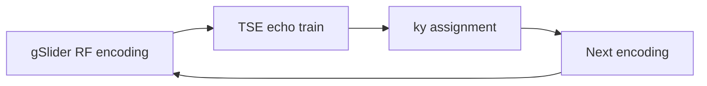

# gSlider-TSE

`TSE_2D_gSlider.m` implements the repository's gSlider-TSE acquisition. The main feature is **gSlider RF encoding combined with a Cartesian 2D TSE echo train**.

```matlab
run('TSE_2D_gSlider.m')
```

The general gSlider RF-encoding method is described by Setsompop et al. [[21]](/references#ref-21 "Setsompop K, Fan Q, Stockmann J, et al. High-resolution in vivo diffusion imaging of the human brain with generalized slice dithered enhanced resolution: simultaneous multislice (gSlider-SMS). Magn Reson Med. 2018;79:141-151."), and the TSE-specific sequence in this repository is associated with the gSlider-TSE work [[14]](/references#ref-14 "Zhang J, Wu Y, Xue R, Zhuo Y, Zhang Z. gSlider-TSE for high-resolution isotropic T2-weighted imaging with high contrast and high SNR. Proc Intl Soc Magn Reson Med. 2024; Program #3256.").

## RF implementation

The bundled gSlider excitation bank is generated offline by `prep/pulse/RF_pulse.ipynb` using

```python
sigpy.mri.rf.slr.dz_gslider_rf(...)
```

and stored as `gSlider_excit_0.01_0.01.mat` for use by the MATLAB sequence code. SigPy is therefore needed only when regenerating the pulse bank, not when using the bundled `.mat` file.

The SLR refocusing pulse bank is generated in the same notebook with `sigpy.mri.rf.slr.dzrf`, following the SLR framework [[20]](/references#ref-20 "Pauly JM, Le Roux P, Nishimura DG, Macovski A. Parameter relations for the Shinnar-Le Roux selective excitation pulse design algorithm. IEEE Trans Med Imaging. 1991;10:53-65.").

## Sequence loop

The gSlider entry point uses dedicated sequence loops:

```text
prep_Seqloop_gSlider
prep_Seqloop_IR_gSlider
```

while sharing the main TSE preparation for system settings, slice positions, PE ordering, gradients, labels, delays, checks, and sequence export.



The gSlider encoding dimension must remain separate from receive-coil, slice, echo, and phase-encoding dimensions.

## Experimental TRAPS test path

The repository also contains an **optional experimental/test path** using `utils/fliptraps.m` to generate a TRAPS-style variable refocusing schedule. It is not a defining feature of the gSlider-TSE implementation and is not emphasized in the normal usage path.

When this test path is enabled:

```matlab
Setup.TRAPS = 'on';
```

`fliptraps.m` follows the TRAPS concept of Hennig et al. [[22]](/references#ref-22 "Hennig J, Weigel M, Scheffler K. Multiecho sequences with variable refocusing flip angles: optimization of signal behavior using smooth transitions between pseudo steady states (TRAPS). Magn Reson Med. 2003;49:527-535."). It is a repository implementation used for testing, not source code distributed by the original authors.

## Reconstruction status

The repository currently generates gSlider-TSE acquisitions but does **not** provide offline gSlider decoding in `recon/matlab`.

`recon_TSE2D` is intended for conventional Cartesian 2D TSE data and should not be interpreted as a gSlider decoder.

## Main source files

| Purpose | Source |
| --- | --- |
| gSlider sequence entry point | `TSE_2D_gSlider.m` |
| gSlider RF generation | `prep/pulse/RF_pulse.ipynb` |
| gSlider sequence loops | `prep/prep_Seqloop_gSlider.m`, `prep/prep_Seqloop_IR_gSlider.m` |
| experimental TRAPS-style schedule | `utils/fliptraps.m` |

See [Dependencies & Method Provenance](/reference/provenance) for method/code attribution.
