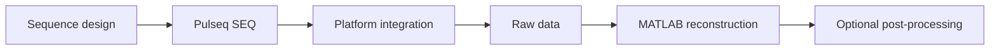

::: warning Research sequence software
This repository is for research sequence development. A valid Pulseq file, successful timing/label checks, optional PNS prediction, or a successful offline reconstruction does **not** establish human-scan safety. Target-scanner RF/SAR, gradient/PNS, interpreter/watchdog behavior, protocol review and local institutional requirements remain mandatory.
:::

## What this repository contains

`tse-pulseq-matlab` combines three engineering layers:



- **Sequence generation** — conventional Cartesian 2D TSE and gSlider-TSE built with Pulseq [[2]](/references#ref-2 "Layton KJ, Kroboth S, Jia F, et al. Pulseq: a rapid and hardware-independent pulse sequence prototyping framework. Magn Reson Med. 2017;77:1544-1552.").
- **Platform integration** — target-system hardware limits, interpreter behavior, metadata mapping, safety/PNS inputs, and scanner validation.
- **Offline reconstruction** — current raw-data reader, prewhitening, navigator correction, RSS/GRAPPA/SENSE/CS, geometry export and optional post-processing.

The package implements RARE/TSE-family acquisitions [[1]](/references#ref-1 "Hennig J, Nauerth A, Friedburg H. RARE imaging: a fast imaging method for clinical MR. Magn Reson Med. 1986;3:823-833.") but the documentation is organized around **source-code behavior and engineering implementation** rather than as a standalone MRI textbook.

## Current testing boundary

The sequence concept is intended to be portable through Pulseq. Scanner development/testing to date has used Siemens 7 T systems, and the maintained offline reader currently consumes Siemens Twix through `mapVBVD`.

These facts are documented as the **current implementation/testing boundary**, not as the central identity of the package. Remaining vendor-specific assumptions that should move out of the reusable sequence core are tracked in [TO DO & implementation checklist](/todo).

## Engineering reading order

```text
install / configure
→ sequence entry point
→ RF + PE + echo-train implementation
→ generated .seq
→ platform integration
→ acquired raw data
→ reconstruction functions + equations
→ optional corrections / denoising
→ validation / safety
→ provenance / references
→ TO DO / missing features
```

Physical or mathematical theory is kept next to the implementation that uses it. Echo-to-$k_y$ behavior is documented with the sequence; the $PFS$ model is explained with SENSE/CS reconstruction.

## Sequence-side implementation map

The maintained entry points are

```text
TSE_2D.m
TSE_2D_gSlider.m
```

They resolve `Setup`, `SetupRF` and `SetupSpoiling`, assemble the TSE loop, run development checks, and export `.seq` plus the resolved MATLAB configuration. See [Sequence Implementation](/sequence-generation).

External/adapted method components are documented explicitly, including Pulseq, SparseMRI-derived CS sampling, SigPy-generated SLR/gSlider RF banks, TRAPS, VERSE, SAFE-model PNS prediction, and reconstruction/denoising methods. See [Dependencies & Method Provenance](/reference/provenance).

## Reconstruction is a companion to the sequence

The bundled reconstruction is not presented as a separate general-purpose MRI reconstruction framework. It exists to make the implemented acquisition inspectable from raw data through image output.

The [Reconstruction](/reconstruction) chapter keeps together

- calling interface;
- preprocessing order;
- equations;
- GRAPPA/SENSE/ESPIRiT/CS implementation;
- coil compression;
- option defaults;
- numerical checks;
- source links; and
- current limitations.

Echo magnitude correction is optional k-space preprocessing. BM3D/NLM/SANLM/TGV2 are optional image-domain post-processing. The package exposes these choices without defining them as universally required.

## Scope and portability boundary

| Layer | Project goal | Current state |
| --- | --- | --- |
| TSE sequence | portable Cartesian Pulseq acquisition | conventional 2D TSE + gSlider-TSE implemented |
| RF assets | reproducible generated waveforms | SLR/gSlider banks generated with SigPy RF |
| PI / CS sampling | explicit logical PE patterns | PI + Lustig-derived variable-density CS path |
| platform integration | replaceable adapter | not yet fully separated from the current development environment |
| PNS prediction | optional platform-dependent check | current code path still needs refactoring to become truly optional |
| raw-data reconstruction | transparent acquisition companion | current reader uses Siemens Twix/mapVBVD |
| gSlider reconstruction | planned | acquisition implemented; decoding not implemented |
| optional filtering | user-selected | echo correction and denoisers remain optional |

## Documentation map

| Section | What it answers |
| --- | --- |
| **Getting Started** | How do I install and generate the sequence? |
| **Sequence** | How are timing, RF, gradients, PE sampling and echo ordering implemented? |
| **Reconstruction** | What does the MATLAB pipeline do, and which methods/options are implemented? |
| **Validation & Safety** | What do software checks establish, and what remains scanner/site responsibility? |
| **TO DO** | Which portability, sequence and reconstruction issues are still open? |
| **Reference & Provenance** | Which functions, external tools, algorithms and papers correspond to each feature? |

## Start here

- First use: **[Quick Start](/quickstart)**.
- Modify the acquisition: **[Sequence Implementation](/sequence-generation)**.
- Understand PE/CS acquisition: **[Phase Encoding & Acceleration](/theory/phase-encoding)**.
- Work on gSlider/TRAPS: **[gSlider-TSE & TRAPS](/guide/gslider-traps)**.
- Reconstruct raw data: **[Reconstruction](/reconstruction)**.
- Check known gaps: **[TO DO & implementation checklist](/todo)**.
- Check algorithm/tool origin: **[Dependencies & Method Provenance](/reference/provenance)**.
- Review scanner-use boundaries: **[Validation & Safety](/validation-and-safety)**.
