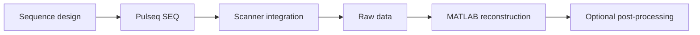

::: warning Research sequence software
This repository is for research sequence development. A valid Pulseq file, successful timing/label checks, a development PNS calculation, or a successful offline reconstruction does **not** establish human-scan safety. Target-scanner RF/SAR, gradient/PNS, interpreter/watchdog behavior, protocol review and local institutional requirements remain mandatory.
:::

## What this repository contains

`tse-pulseq-matlab` combines three related engineering layers:



- **Sequence generation** — conventional Cartesian 2D TSE and gSlider-TSE built with Pulseq [[2]](/references#ref-2 "Layton KJ, Kroboth S, Jia F, et al. Pulseq: a rapid and hardware-independent pulse sequence prototyping framework. Magn Reson Med. 2017;77:1544-1552.").
- **Platform integration** — current scanner presets, Siemens LIN/ICE metadata and PNS development checks needed by the validated Siemens 7 T implementation.
- **Offline reconstruction** — Siemens Twix reading, prewhitening, navigator correction, RSS/GRAPPA/SENSE/CS, geometry export and optional post-processing.

The package implements RARE/TSE-family acquisitions [[1]](/references#ref-1 "Hennig J, Nauerth A, Friedburg H. RARE imaging: a fast imaging method for clinical MR. Magn Reson Med. 1986;3:823-833.") but the documentation is organized around **source-code behavior**, not as a standalone MRI textbook.

## Engineering reading order

A practical reading path is

```text
install / configure
→ sequence entry point
→ RF + PE + echo-train implementation
→ platform adapter
→ generated .seq
→ acquired raw data
→ reconstruction functions + equations
→ optional corrections / denoising
→ validation / safety
→ provenance / references
```

Physical or mathematical theory is kept next to the implementation that uses it. For example, echo-to-$k_y$ signal behavior is under the Sequence section, while the $PFS$ model is explained alongside the SENSE/CS implementation.

## Sequence-side implementation map

The principal entry points are

```text
TSE_2D.m
TSE_2D_gSlider.m
```

They resolve `Setup`, `SetupRF` and `SetupSpoiling` through the `prep/` functions, assemble the TSE loop, run checks and export `.seq` plus the resolved MATLAB configuration. See [Sequence implementation](/sequence-generation).

The repository also contains external or adapted method components whose provenance is made explicit:

- Pulseq sequence building [[2]](/references#ref-2 "Layton KJ, Kroboth S, Jia F, et al. Pulseq. Magn Reson Med. 2017;77:1544-1552.");
- Lustig SparseMRI-derived CS sampling utilities [[8]](/references#ref-8 "Lustig M, Donoho D, Pauly JM. Sparse MRI: the application of compressed sensing for rapid MR imaging. Magn Reson Med. 2007;58:1182-1195.");
- SigPy-generated SLR/gSlider RF pulse banks, with SLR [[20]](/references#ref-20 "Pauly JM, Le Roux P, Nishimura DG, Macovski A. Parameter relations for the Shinnar-Le Roux selective excitation pulse design algorithm. IEEE Trans Med Imaging. 1991;10:53-65.") and gSlider [[21]](/references#ref-21 "Setsompop K, Fan Q, Stockmann J, et al. gSlider-SMS. Magn Reson Med. 2018;79:141-151.") method references;
- TRAPS-style variable refocusing [[22]](/references#ref-22 "Hennig J, Weigel M, Scheffler K. TRAPS. Magn Reson Med. 2003;49:527-535."); and
- the external VERSE submodule with documented upstream lineage [[23]](/references#ref-23 "Lee D, Lustig M, Grissom WA, Pauly JM. Time-optimal design for multidimensional and parallel transmit variable-rate selective excitation. Magn Reson Med. 2009;61:1471-1479.").

See [Dependencies & method provenance](/reference/provenance) for the file-by-file map.

## Reconstruction is a companion to the sequence

The bundled reconstruction is not presented as a separate general-purpose MRI reconstruction framework. Its job is to make the implemented acquisition inspectable from Siemens Twix raw data through image output.

The [Reconstruction](/reconstruction) chapter therefore keeps together

- `recon_TSE2D` calling interface;
- preprocessing order;
- equations;
- GRAPPA/SENSE/ESPIRiT/CS implementation choices;
- PCA coil compression;
- option defaults;
- numerical checks;
- source links; and
- current limitations.

Echo magnitude correction is an [optional k-space preprocessing feature](/guide/echo-corrections). BM3D/NLM/SANLM/TGV2 are [optional image-domain post-processing](/guide/denoising). The package exposes those choices without deciding that they should be used for every dataset.

## Scope and portability boundary

| Layer | Project goal | Current implementation |
| --- | --- | --- |
| TSE sequence concept | portable Cartesian Pulseq acquisition | developed/tested with current Siemens 7 T adapter |
| Pulseq file | vendor-neutral sequence description | requires a compatible target-platform interpreter |
| RF pulse banks | reproducible generated waveform assets | SLR/gSlider banks generated with SigPy RF |
| PI / CS sampling | explicit logical PE patterns | PI + Lustig-derived 1D variable-density CS path |
| scanner integration | replaceable platform adapter | current documented LIN/ICE/PNS path is Siemens specific |
| raw-data reconstruction | transparent acquisition companion | current reader is Siemens Twix/mapVBVD |
| gSlider reconstruction | future extension | acquisition implemented; decoding not implemented |
| optional filtering | user-selected tools | echo equalization and denoisers disabled/not invoked by default |

Thus **vendor-neutral is an acquisition-design goal, not a claim that every current integration/reconstruction source file is vendor independent**.

## Documentation map

| Section | What it answers |
| --- | --- |
| **Getting Started** | How do I install, generate and reconstruct first data? |
| **Sequence Implementation** | How are timing, RF, gradients, PE sampling, echo ordering and exported Pulseq events implemented? |
| **Reconstruction** | What does the MATLAB pipeline do, which equations/options does it use, and which source functions implement them? |
| **Validation & Safety** | What has been checked and what must still be verified before scanner/human use? |
| **Reference & Provenance** | Which functions, external tools, adapted algorithms, papers and licenses correspond to each feature? |
| **Support** | How are implementation/build/runtime problems diagnosed? |

## Start here

- First use: **[Quick Start](/quickstart)**.
- Modify the sequence: **[Sequence implementation](/sequence-generation)**.
- Understand PE/CS acquisition: **[Phase encoding & acceleration](/theory/phase-encoding)**.
- Work on gSlider/TRAPS: **[gSlider-TSE & TRAPS](/guide/gslider-traps)**.
- Reconstruct raw data: **[Reconstruction](/reconstruction)**.
- Check where an algorithm/tool came from: **[Dependencies & method provenance](/reference/provenance)**.
- Prepare scanner experiments: **[Validation & safety](/validation-and-safety)**.
