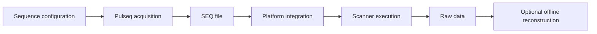

# Platform integration

The sequence is implemented with Pulseq so that the **acquisition definition** can be kept separate from scanner-vendor integration as much as practical.

The reusable sequence layer should describe

- RF, gradient and ADC events;
- timing and echo-train structure;
- logical readout / phase-encoding / slice axes;
- logical $k_y$ sampling and ACS intent;
- slice ordering;
- PI/CS sampling; and
- Pulseq labels and sequence definitions that are genuinely acquisition-level metadata.

The target platform is responsible for turning that description into a scanner execution environment.

## What belongs to platform integration

A scanner/platform adapter may need to supply or translate

- absolute hardware limits and raster/dead-time constraints;
- PNS/safety-model inputs;
- Pulseq interpreter capabilities;
- logical-to-physical axis conventions;
- scanner-specific line/index metadata;
- PI/ACS metadata required by online reconstruction;
- navigator/phase-correction metadata;
- raw-data format and metadata parsing; and
- scanner-specific validation procedures.

These are not definitions of TSE itself.

## Current implementation status

The repository is **not yet fully platform-decoupled**. Development and scanner testing have so far used Siemens 7 T systems, and several source files still contain assumptions from that environment.

Current examples include

- scanner profiles embedded in `prep_System`;
- platform-specific PE line mapping in the PI path;
- interpreter-facing definitions in the common preparation path;
- a PNS check that currently assumes external SAFE-model tooling plus target-system hardware parameters; and
- an offline raw-data reader based on Siemens Twix / `mapVBVD`.

These are current implementation constraints, not intended public abstractions. The related refactoring work is tracked in [TO DO & implementation checklist](/todo).

::: info Current validation boundary
Scanner testing to date has been performed on Siemens 7 T systems. This should be read as **where the code has been tested**, not as a requirement that the sequence concept is Siemens-specific.
:::

## Porting checklist

When moving the sequence to another Pulseq-capable platform:

1. define the target hardware limits and raster/dead-time constraints;
2. confirm Pulseq interpreter support for the sequence events and labels;
3. preserve the logical $k_y$ / echo-order definition while adapting platform line/index metadata;
4. define the target platform's PI/ACS and online-reconstruction metadata contract if online reconstruction is used;
5. verify coordinate/orientation handling;
6. provide an appropriate PNS/safety strategy for that platform;
7. establish an `R=1` phantom baseline before accelerated modes;
8. validate PI/CS/navigator behavior separately; and
9. add a raw-data reader only if offline reconstruction is required.

A new platform should be treated as a new validation target rather than inheriting validation from another scanner.

## PNS prediction

PNS prediction is a **platform-dependent development feature**, not part of the Pulseq sequence definition itself.

The current `check_PNS` path calls Pulseq `Sequence.calcPNS`, whose tracked MATLAB implementation uses the external [`safe_pns_prediction`](https://github.com/filip-szczepankiewicz/safe_pns_prediction) package. A hardware model compatible with the target gradient system is also required for that calculation.

The repository does not distribute scanner-vendor hardware-model files. Planned work is to make this path explicitly optional so sequence generation can proceed independently of whether a PNS prediction package/hardware model is installed. See [TO DO](/todo).

## Raw-data reconstruction

A portable sequence does not require a portable raw-data file format. The current companion reconstruction reads Siemens Twix through `mapVBVD`; this is an implementation detail of the current reader.

A future vendor-independent reconstruction interface should map any supported vendor's native data and metadata into a common internal representation before the numerical reconstruction steps.

## Related pages

- [Sequence Implementation](/sequence-generation)
- [Phase Encoding & Acceleration](/theory/phase-encoding)
- [Reconstruction](/reconstruction)
- [Validation & Safety](/validation-and-safety)
- [TO DO & implementation checklist](/todo)
