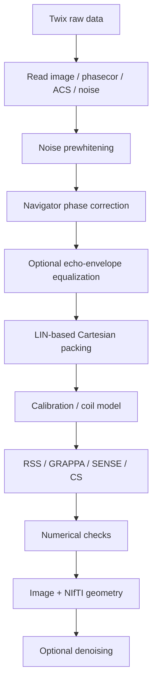

# Reconstruction

The repository includes a transparent MATLAB reconstruction for **conventional Cartesian 2D TSE Siemens Twix data**. Its purpose is to make the sequence implementation inspectable and reproducible from raw data through image export.

The public entry point is

```matlab
result = recon_TSE2D(filename, Name, Value, ...)
```

[Source: `recon/matlab/recon_TSE2D.m`](https://github.com/BennyZhang-Codes/tse-pulseq-matlab/blob/vitepress-style/recon/matlab/recon_TSE2D.m)

::: warning Scope
The current offline path does not decode gSlider, does not provide a non-Siemens raw-data reader, and does not claim pixel-for-pixel equivalence with proprietary Siemens ICE reconstruction.
:::

## Processing pipeline



The ordering is deliberate: prewhitening establishes a common coil/noise basis before calibration; navigator corrections are applied before k-space packing; optional image-domain denoising occurs only after reconstruction.

## 1. Twix data input

`read_TSE2D_twix.m` uses external [mapVBVD](https://github.com/pehses/mapVBVD) to expose image data, `phasecor` navigators, PAT `refscan` data, compatible reference phase-correction information, and receive-noise data.

The pipeline tracks `LIN`, `SLC`, and `SEG` so acquisitions can be mapped to PE rows, slices, and TSE echoes. Siemens LIN is zero based on the sequence/platform side, while mapVBVD/MATLAB indices are one based. See [Siemens 7 T LIN & ICE](/phase-encoding-and-ice).

## 2. Receive-noise prewhitening

Let $\Psi$ be the complex receive-noise covariance. The implementation constructs a regularized inverse Hermitian square root $W_N$ such that

$$
W_N\Psi W_N^H\approx I.
$$

The same transform is applied to image, navigator, and compatible calibration streams. This follows standard phased-array/noise normalization principles [[3]](/references#ref-3 "Roemer PB, Edelstein WA, Hayes CE, Souza SP, Mueller OM. The NMR phased array. Magn Reson Med. 1990;16:192-225.") [[4]](/references#ref-4 "Kellman P, McVeigh ER. Image reconstruction in SNR units: a general method for SNR measurement. Magn Reson Med. 2005;54:1439-1447.").

If no usable noise scan is available, the code warns and falls back rather than silently claiming successful prewhitening.

Main options:

| Option | Default |
| --- | --- |
| `Prewhiten` | `true` |
| `NoiseShrinkage` | `0.02` |
| `NoiseEigenvalueFloor` | `1e-6` |

## 3. Navigator phase correction

For slice $s$, echo $e$, coil $c$, and normalized readout coordinate $\kappa$,

$$
z_{s,e,c}(\kappa)=n_{s,e,c}(\kappa)n^*_{s,e_{\mathrm{ref}},c}(\kappa),
$$

and the implementation fits

$$
\arg z_{s,e,c}(\kappa)\approx\beta_{1,s,e,c}\kappa+\beta_{0,s,e,c}.
$$

The constant and readout-linear terms are removed from compatible image/reference acquisitions before packing. This is a repository implementation and is not intended to reproduce proprietary ICE filtering internals.

## 4. Optional echo-magnitude correction

The navigator train can also estimate a normalized echo envelope $A_{s,e}$. If explicitly enabled, the package can apply power-law or normalized Wiener-style regularized equalization before Cartesian packing.

This is an **optional user-selected preprocessing step** and is disabled by default. It is a measured global echo-envelope equalizer, not a voxelwise T2/B1 inversion. See [Echo phase & magnitude correction](/guide/echo-corrections).

## 5. Cartesian k-space packing

`pack_TSE2D_kspace.m` maps acquisitions to Cartesian rows using MDH LIN and averages repeated acquisitions assigned to the same encoded row. Imaging/reference views are handled so shared physical data are not unintentionally double weighted.

## 6. Reconstruction methods

`ReconstructionMethod` accepts

```text
auto
rss
grappa
sense
cs
```

| Method | Implementation in this package | Method basis |
| --- | --- | --- |
| `rss` | centered coil-wise IFFT + root-sum-of-squares | phased-array combination [[3]](/references#ref-3 "Roemer PB, Edelstein WA, Hayes CE, Souza SP, Mueller OM. The NMR phased array. Magn Reson Med. 1990;16:192-225.") |
| `grappa` | regular Cartesian 1D PE-GRAPPA calibrated from ACS; acquired rows are preserved | GRAPPA [[5]](/references#ref-5 "Griswold MA, Jakob PM, Heidemann RM, et al. Generalized autocalibrating partially parallel acquisitions (GRAPPA). Magn Reson Med. 2002;47:1202-1210.") |
| `sense` | regularized Cartesian SENSE with ESPIRiT sensitivity maps | SENSE [[6]](/references#ref-6 "Pruessmann KP, Weiger M, Scheidegger MB, Boesiger P. SENSE: sensitivity encoding for fast MRI. Magn Reson Med. 1999;42:952-962."); ESPIRiT [[7]](/references#ref-7 "Uecker M, Lai P, Murphy MJ, et al. ESPIRiT. Magn Reson Med. 2014;71:990-1001.") |
| `cs` | same Cartesian multicoil model + isotropic TV + Haar-L1 | Sparse MRI [[8]](/references#ref-8 "Lustig M, Donoho D, Pauly JM. Sparse MRI. Magn Reson Med. 2007;58:1182-1195."); Chambolle-Pock [[9]](/references#ref-9 "Chambolle A, Pock T. A first-order primal-dual algorithm for convex problems with applications to imaging. J Math Imaging Vis. 2011;40:120-145.") |

For reproducible comparisons, choose a reconstruction method explicitly rather than relying on `auto`.

## 7. GRAPPA implementation

`recon_TSE2D_GRAPPA.m` is a repository-local implementation of **regular Cartesian 1D PE-GRAPPA** [[5]](/references#ref-5 "Griswold MA, Jakob PM, Heidemann RM, et al. Generalized autocalibrating partially parallel acquisitions (GRAPPA). Magn Reson Med. 2002;47:1202-1210.").

For each missing PE residue/offset pattern, the code selects acquired source lines, calibrates a multicoil kernel from the contiguous ACS region, applies relative Tikhonov regularization, and fills only missing PE rows. Acquired imaging and ACS samples are preserved.

Current options are

| Option | Default |
| --- | ---: |
| `GRAPPA` | `true` |
| `GrappaKySourceCount` | `4` |
| `GrappaKxKernel` | `0` |
| `GrappaRegularization` | `1e-4` |

`GrappaKxKernel=0` means the default kernel uses no neighboring readout offsets; other integer readout offsets can be supplied explicitly.

### Current GRAPPA limitations

The implementation is complete for its intended scope, but that scope is deliberately narrower than a general vendor reconstruction framework:

- acceleration is along the phase-encoding dimension only;
- `R` must be an integer `>= 2`;
- the undersampled imaging data are expected to follow a regular Cartesian acceleration lattice;
- calibration expects an integrated contiguous ACS region;
- partial-Fourier GRAPPA is not implemented;
- SMS/slice-GRAPPA is not implemented;
- non-Cartesian GRAPPA is not implemented;
- irregular variable-density/CS sampling masks are not reconstructed by this GRAPPA path; and
- Siemens ICE-specific kernel selection, scaling, coil processing, and image filtering are not reproduced.

These are explicit support boundaries, not a reason to label the implemented method as a separate or incomplete type of GRAPPA.

## 8. Shared SENSE/CS encoding operator

After preprocessing and packing, iterative methods use

$$
A=PFS,
$$

where $S$ applies complex coil sensitivities, $F$ is the centered unitary Cartesian Fourier transform, and $P$ selects acquired PE rows.

The physical TSE acquisition remains echo dependent; this $PFS$ operator is the current corrected numerical reconstruction model.

### SENSE

The maintained SENSE path solves

$$
\min_x\frac12\lVert Ax-y\rVert_2^2+\frac{\lambda_2}{2}\lVert x\rVert_2^2
$$

with conjugate gradients on the normal equations.

Defaults:

| Option | Default |
| --- | ---: |
| `SENSEIterations` | `50` |
| `SENSETolerance` | `1e-5` |
| `SENSETikhonov` | `1e-4` |

### Cartesian CS

The CS implementation solves

$$
\min_x\frac12\lVert Ax-y\rVert_2^2+\lambda_{\mathrm{TV}}\lVert Dx\rVert_{2,1}+\lambda_W\lVert W_Hx\rVert_1,
$$

using a Chambolle-Pock primal-dual iteration [[9]](/references#ref-9 "Chambolle A, Pock T. A first-order primal-dual algorithm for convex problems with applications to imaging. J Math Imaging Vis. 2011;40:120-145.").

Defaults:

| Option | Default |
| --- | ---: |
| `CSIterations` | `250` |
| `CSTVWeight` | `0.006` |
| `CSWaveletWeight` | `0.0005` |
| `CSWaveletLevels` | `2` |

These are repository starting values, not universally optimal regularization parameters.

## 9. Coil compression and sensitivity maps

The iterative path can use ACS-derived global PCA coil compression before sensitivity estimation. The default retains 99% calibration energy with at most 12 virtual coils. This is global array compression [[24]](/references#ref-24 "Buehrer M, Pruessmann KP, Boesiger P, Kozerke S. Array compression for MRI with large coil arrays. Magn Reson Med. 2007;57:1131-1139."), not geometric coil compression (GCC).

The default sensitivity path is a repository-local single-map ESPIRiT estimator [[7]](/references#ref-7 "Uecker M, Lai P, Murphy MJ, et al. ESPIRiT. Magn Reson Med. 2014;71:990-1001.").

## 10. Numerical checks

Before SENSE or CS iteration, the forward/adjoint inner-product identity is tested. A relative mismatch greater than `5e-5` stops reconstruction.

GRAPPA stores calibration NMSE and regularized normal-matrix conditioning for its fitted kernels. These are implementation/calibration checks, not proof of equivalence to a vendor reconstruction.

Other checks include finite outputs, solver residual histories, navigator fit/SNR information, ESPIRiT calibration/support information, coil-compression retained energy, and NIfTI geometry consistency.

## 11. GPU and precision

SENSE/CS can use MATLAB GPU execution through

```matlab
'IterativeUseGPU', 'auto'
```

RSS and GRAPPA run on the standard MATLAB path and do not require GPU support.

## 12. Output and geometry

Important output options include

| Option | Default |
| --- | --- |
| `KeepKspace` | `false` |
| `OutputDir` | `''` |
| `SaveMat` | `true` when output is requested |
| `SaveFigures` | `true` when output is requested |
| `SaveNifti` | `false` |
| `OverwriteOutputs` | `false` |

The NIfTI path derives scanner-patient RAS geometry from Siemens MDH slice centers/quaternions when available and validates reconstructed slice centers before writing.

## 13. Optional post-reconstruction denoising

NLM, BM3D, SANLM and TGV2 are provided as a **separate optional image-domain module**. They are not called automatically by `recon_TSE2D`. See [Optional denoising](/guide/denoising).

## Current reconstruction limitations

The current MATLAB workflow does **not** implement:

- gSlider decoding;
- partial Fourier reconstruction;
- SMS;
- non-Cartesian reconstruction;
- multiple ESPIRiT map sets;
- non-Siemens raw-data readers; or
- proprietary Siemens ICE scaling, coil-combination, GRAPPA-kernel, or image-filtering behavior.

These boundaries should be reported directly rather than hidden behind qualitative labels for the implemented methods.

## Source map

| Function | Role |
| --- | --- |
| [`recon_TSE2D.m`](https://github.com/BennyZhang-Codes/tse-pulseq-matlab/blob/vitepress-style/recon/matlab/recon_TSE2D.m) | pipeline and user-facing options |
| [`read_TSE2D_twix.m`](https://github.com/BennyZhang-Codes/tse-pulseq-matlab/blob/vitepress-style/recon/matlab/read_TSE2D_twix.m) | Twix reader / metadata extraction |
| [`recon_TSE2D_GRAPPA.m`](https://github.com/BennyZhang-Codes/tse-pulseq-matlab/blob/vitepress-style/recon/matlab/recon_TSE2D_GRAPPA.m) | 1D PE-GRAPPA |
| [`recon_TSE2D_SENSE.m`](https://github.com/BennyZhang-Codes/tse-pulseq-matlab/blob/vitepress-style/recon/matlab/recon_TSE2D_SENSE.m) | SENSE solver |
| [`recon_TSE2D_CS.m`](https://github.com/BennyZhang-Codes/tse-pulseq-matlab/blob/vitepress-style/recon/matlab/recon_TSE2D_CS.m) | Cartesian CS solver |
| [`estimate_TSE_phasecor.m`](https://github.com/BennyZhang-Codes/tse-pulseq-matlab/blob/vitepress-style/recon/matlab/estimate_TSE_phasecor.m) | navigator model |
| [`pack_TSE2D_kspace.m`](https://github.com/BennyZhang-Codes/tse-pulseq-matlab/blob/vitepress-style/recon/matlab/pack_TSE2D_kspace.m) | Cartesian packing |
| [`utils/prepare_TSE2D_sense_model.m`](https://github.com/BennyZhang-Codes/tse-pulseq-matlab/blob/vitepress-style/recon/matlab/utils/prepare_TSE2D_sense_model.m) | iterative calibration/model preparation |

For controlled comparisons, continue with [Reconstruction protocol](/validation/reconstruction-protocol) and [Validation strategy](/validation/scientific-validation).
