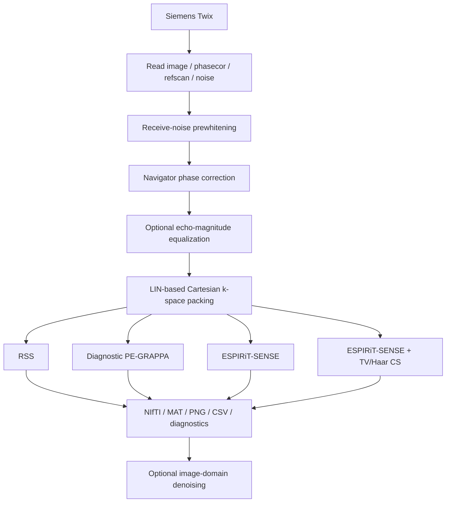

# Offline reconstruction — Siemens Twix

The bundled MATLAB reconstruction currently targets **conventional Cartesian 2D TSE Siemens Twix data**. This is the present raw-data implementation, not a restriction of the Pulseq sequence model. The sequence architecture and raw-data/platform boundary are described in [Architecture](/concepts-overview) and [Platform Integration](/platform-integration).

Main entry points:

```text
recon/matlab/examples/run_recon_TSE2D.m
recon/matlab/examples/run_recon_TSE2D_iterative.m
recon/matlab/recon_TSE2D.m
```

::: warning Scope
The offline reconstruction does **not** currently decode gSlider acquisitions, does not include raw-data readers for other MRI vendors, and does not claim pixel-for-pixel equivalence with Siemens ICE.
:::

## Reconstruction workflow



The processing order is deliberate. Noise whitening establishes a common receive-coil basis before navigator estimation. Phase and magnitude corrections are then applied consistently to imaging and compatible PAT-reference data before k-space assembly and calibration-based reconstruction.

For the correction mathematics and defaults, see [Echo phase & magnitude correction](/guide/echo-corrections). Optional post-reconstruction filtering is documented separately in [Image-domain denoising](/guide/denoising).

## Twix streams and MDH counters

`read_TSE2D_twix.m` reads the available Siemens streams used by the pipeline:

- image data;
- `phasecor` navigators;
- PAT `refscan` data;
- `refscanPC` metadata/view;
- receive-noise data.

The reconstruction retains the counters needed to interpret the acquisition:

- `LIN` — phase-encoding line;
- `SLC` — slice;
- `SEG` — TSE echo index.

Within MATLAB/mapVBVD these indices are one-based. The current sequence-side Siemens LIN metadata are zero-based, so compare them only after accounting for the index-base shift described in [Siemens 7 T LIN & ICE](/phase-encoding-and-ice).

## Readout oversampling and noise

Readout oversampling is removed from image, navigator, and reference streams by default.

Receive-noise data are intentionally loaded without the same image-domain cropping. Cropping can correlate neighboring noise samples and bias the estimated receive covariance, which would defeat the purpose of noise prewhitening.

## Noise prewhitening

Prewhitening is enabled by default:

```matlab
'Prewhiten', true
'NoiseShrinkage', 0.02
```

A regularized complex receive covariance is estimated from the noise data, and its Hermitian inverse square root defines the coil transform. The same transform is applied to image, phase-correction, and PAT-reference streams.

If no usable noise stream is available, the code warns and uses an identity transform rather than silently treating unwhitened data as whitened.

## Echo corrections

The offline correction layer contains two distinct operations:

1. **navigator phase correction** — a per-slice, per-echo, per-coil constant plus readout-linear phase model;
2. **optional echo-magnitude equalization** — power-law or normalized Wiener-style weighting derived from the navigator amplitude envelope.

The library API keeps echo-magnitude correction disabled by default for backward compatibility. The maintained routine-use example opts into the Wiener-style experimental workflow with `alpha=0`, automatic regularization, and a smooth maximum-gain target of 2.

Do not treat magnitude equalization as a free sharpness improvement: upweighting attenuated echoes also upweights their noise. See [Echo phase & magnitude correction](/guide/echo-corrections) for the equations and interpretation.

## Cartesian k-space packing

Acquisitions are placed into k-space according to MDH LIN. Repeated acquisitions of the same encoded row are averaged.

When image and reference views identify the same physical line, the workflow avoids intentionally counting that physical acquisition twice. The packed data therefore represent the acquired Cartesian rows rather than a reconstruction-method-specific resampling.

## Reconstruction methods

`ReconstructionMethod` accepts

```text
auto
rss
grappa
sense
cs
```

### RSS

Centered 2D inverse FFT is applied coil-by-coil, followed by root-sum-of-squares magnitude combination in the current prewhitened coil basis.

RSS is the simplest transparent reference path and is especially useful for fully sampled debugging and acquisition validation.

### Diagnostic PE-GRAPPA

The repository implements a transparent one-dimensional PE-GRAPPA baseline for integer acceleration factors $R\ge2$.

Only missing phase-encoding lines are synthesized; acquired imaging and ACS data are preserved. The default diagnostic kernel uses four PE source lines, no readout neighbors, and relative Tikhonov loading of `1e-4`.

This implementation is intentionally simpler than Siemens ICE GRAPPA. Use it as a controlled offline baseline, not as evidence of proprietary reconstruction equivalence. See [Griswold et al.](/references#ref-grappa "Griswold et al., GRAPPA, MRM 2002").

### ESPIRiT-SENSE

SENSE and CS share the same Cartesian multicoil encoding model,

$$
Ax=PFSx,
$$

where $S$ applies complex coil sensitivities, $F$ is a centered unitary 2D FFT, and $P$ is the acquired-line mask.

Ordinary SENSE solves

$$
\min_x
\frac12\lVert Ax-y\rVert_2^2
+
\frac{\lambda_2}{2}\lVert x\rVert_2^2
$$

using conjugate gradients on the normal equations.

Typical starting settings are

```matlab
'SENSEIterations', 50
'SENSETolerance', 1e-5
'SENSETikhonov', 1e-4
```

### Cartesian compressed sensing

The CS solver minimizes

$$
\frac12\lVert Ax-y\rVert_2^2
+
\lambda_{\mathrm{TV}}\lVert Dx\rVert_{2,1}
+
\lambda_{\mathrm W}\lVert Wx\rVert_1,
$$

where $D$ is the 2D finite-difference operator and $W$ is an orthonormal Haar transform. Coarsest-scale Haar approximation coefficients are not penalized.

A Chambolle-Pock primal-dual iteration is used. Reference-tested starting settings in the example are

```matlab
'CSIterations', 250
'CSTVWeight', 0.006
'CSWaveletWeight', 0.0005
'CSWaveletLevels', 2
```

These are starting values, not universal optima. Retune them when resolution, contrast, sampling mask, coil array, acceleration, or calibration changes. See [Lustig et al.](/references#ref-sparse-mri "Lustig et al., Sparse MRI, MRM 2007") and [Chambolle & Pock](/references#ref-chambolle-pock "Chambolle and Pock, primal-dual algorithm, JMIV 2011").

## Coil compression and ESPIRiT

Iterative reconstruction can use ACS-derived global PCA coil compression before sensitivity estimation. Typical settings are

```matlab
'CoilCompressionEnergy', 0.99
'MaximumVirtualCoils', 12
```

The default sensitivity method is a native MATLAB single-map ESPIRiT implementation. The calibration path extracts contiguous ACS data, builds a block-Hankel calibration matrix, retains its signal subspace, constructs an image-domain covariance operator, estimates the dominant eigenvector/eigenvalue, crops support by eigenvalue threshold, and RSS-normalizes the retained maps.

The direct estimator requires enough contiguous ACS data; the higher-level iterative workflow also refuses to proceed when central calibration is insufficient. See [Uecker et al.](/references#ref-espirit "Uecker et al., ESPIRiT, MRM 2014").

## Numerical safeguards

Before SENSE or CS iterations, the implementation performs a numerical inner-product test of the forward and adjoint operators. A relative mismatch greater than `5e-5` stops reconstruction.

Other safeguards include calibration-size checks, finite-output checks, solver histories, ESPIRiT support diagnostics, and NIfTI geometry validation. These checks should not be disabled merely to make a dataset run; a failure generally indicates that the model or data geometry needs to be understood first.

## GPU behavior

Use

```matlab
'IterativeUseGPU', 'auto'
```

`'auto'` attempts to use a supported MATLAB GPU and otherwise falls back to CPU. RSS and diagnostic GRAPPA do not require GPU execution.

## NIfTI geometry

The current NIfTI writer derives scanner-patient RAS geometry from Siemens MDH slice centers and quaternions when available. It validates slice spacing/orientation and verifies reconstructed slice centers against the affine before writing.

This is stricter than recording only voxel dimensions and is important for comparisons across matrices, resolutions, or slice stacks in scanner physical space.

## Known limitations

The current offline MATLAB path excludes:

- raw-data readers for non-Siemens platforms;
- gSlider decoding;
- partial Fourier;
- SMS;
- non-Cartesian trajectories;
- multiple ESPIRiT map sets;
- proprietary Siemens raw-data scaling, coil combination, and filtering.

Image-domain denoising is optional and occurs after reconstruction. It cannot recover signal or resolution that was not encoded in the acquisition.
