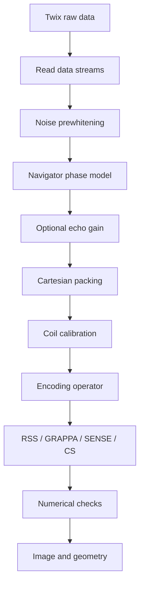

# Reconstruction workflow

The bundled MATLAB reconstruction currently targets **conventional Cartesian 2D TSE Siemens Twix data**. This page describes the scientific processing chain; option-by-option calling details are kept in the [Reconstruction API](/reference/reconstruction-api).

::: warning Scope
The current offline path does not decode gSlider acquisitions, does not provide non-Siemens raw-data readers, and does not claim pixel-for-pixel equivalence with Siemens ICE.
:::

## Workflow

The ordering is deliberate. Prewhitening establishes a common receive-noise basis before navigator estimation. Echo corrections are applied before Cartesian packing/calibration so the reconstruction methods receive a consistent corrected dataset.

For matched method comparisons, freeze the choices on [Reconstruction protocol](/validation/reconstruction-protocol) before collecting performance or image-quality metrics.

## 1. Measured data

`read_TSE2D_twix.m` exposes the Siemens streams used by the maintained pipeline:

- image data;
- `phasecor` navigators;
- PAT `refscan` data;
- compatible reference phase-correction metadata; and
- receive-noise data.

The current reconstruction tracks `LIN`, `SLC`, and `SEG` counters required to map acquisitions into physical slices, PE rows, and TSE echoes.

Sequence-side Siemens LIN is zero based, whereas mapVBVD/MATLAB indexing is one based. This is an implementation convention rather than a change in physical $k_y$; see [Symbols & notation](/theory/symbols) and [Siemens 7 T LIN & ICE](/phase-encoding-and-ice).

## 2. Receive-noise prewhitening

Let $\Psi$ denote the complex receive-noise covariance. A regularized inverse square root defines the whitening transform

$$
W_N\Psi W_N^H\approx I.
$$

The same coil transform is applied to image, navigator, and compatible PAT-reference streams.

Noise data are not cropped using the same image-domain readout operation, because cropping can introduce correlations and bias the covariance estimate. If a usable noise stream is unavailable, the maintained code warns and falls back rather than silently labeling the data as whitened.

The phased-array/noise basis is standard MRI practice [[3]](/references#ref-3 "Roemer et al. phased array, MRM 1990") [[4]](/references#ref-4 "Kellman and McVeigh, SNR units, MRM 2005").

## 3. Echo phase and magnitude correction

The navigator layer estimates two distinct measured effects:

1. a per-slice/per-echo/per-coil phase model containing constant and readout-linear terms; and
2. an optional echo-magnitude envelope used by power or Wiener-style equalization.

These operations are preprocessing of measured k-space. They do **not** turn the physical TSE signal into a single-exponential model and do not fully invert stimulated-echo/B1/slice-profile effects.

Magnitude equalization has a noise cost whenever a weak echo is upweighted, so any sharpening claim should be reported together with gain/noise behavior. Full equations are in [Echo phase & magnitude correction](/guide/echo-corrections).

## 4. Cartesian k-space assembly

Corrected acquisitions are placed into k-space using MDH LIN. Repeated acquisitions of the same encoded row are averaged.

The packing stage should be considered part of the encoding model rather than a file-format detail: assigning an acquisition to the wrong row changes the echo-to-$k_y$ mapping and therefore the TSE point-spread behavior.

Acquired imaging and reference rows should not be unintentionally double-counted simply because they appear in separate Twix views.

## 5. Common iterative encoding model

After measured echo correction and Cartesian packing, SENSE and CS use

$$
A=PFS,
$$

where

- $S$ applies complex coil sensitivities;
- $F$ is a centered unitary Cartesian Fourier transform; and
- $P$ selects acquired k-space rows.

This is the **current numerical reconstruction model**, not the full echo-dependent physical model. The distinction from

$$
y_e=P_eFSD_ex+\varepsilon_e
$$

is developed in [TSE signal and echo-train model](/theory/tse-echo-train).

## 6. Reconstruction methods

| Method | Role in this repository | Scientific interpretation |
| --- | --- | --- |
| **RSS** | Transparent acquired-data baseline | Coil-by-coil centered IFFT followed by root-sum-of-squares |
| **PE-GRAPPA** | Diagnostic PI baseline | Synthesizes missing PE rows from ACS while preserving acquired rows [[5]](/references#ref-5 "Griswold et al. GRAPPA, MRM 2002") |
| **ESPIRiT-SENSE** | Main iterative PI path | Solves a regularized inverse problem with sensitivity encoding [[6]](/references#ref-6 "Pruessmann et al. SENSE, MRM 1999") and ESPIRiT calibration [[7]](/references#ref-7 "Uecker et al. ESPIRiT, MRM 2014") |
| **Cartesian CS** | Regularized iterative path | Uses the same $PFS$ model with TV and Haar sparsity penalties [[8]](/references#ref-8 "Lustig et al. Sparse MRI, MRM 2007") |

### ESPIRiT-SENSE

The maintained SENSE objective is

$$
\min_x
\frac12\lVert Ax-y\rVert_2^2
+
\frac{\lambda_2}{2}\lVert x\rVert_2^2.
$$

Conjugate gradients are applied to the normal equations.

### Cartesian compressed sensing

The maintained CS model is

$$
\min_x
\frac12\lVert Ax-y\rVert_2^2
+
\lambda_{\mathrm{TV}}\lVert Dx\rVert_{2,1}
+
\lambda_W\lVert W_Hx\rVert_1,
$$

where $D$ is the 2D finite-difference operator and $W_H$ is an orthonormal Haar transform. The current implementation uses a Chambolle-Pock primal-dual iteration [[9]](/references#ref-9 "Chambolle and Pock, JMIV 2011").

Solver defaults are starting points rather than universal optima. Exact current options are documented in the [Reconstruction API](/reference/reconstruction-api).

## 7. Coil preprocessing and sensitivity estimation

The iterative path can use ACS-derived global PCA coil compression before sensitivity estimation. The default sensitivity method is a native MATLAB single-map ESPIRiT implementation.

This calibration stage belongs to the reconstruction workflow, but the detailed parameter list is intentionally not repeated here. Use [Reconstruction API](/reference/reconstruction-api) for the interface and [Reconstruction protocol](/validation/reconstruction-protocol) for what must remain fixed during a comparison.

## 8. Numerical checks

Before SENSE or CS iterations, the implementation checks the forward/adjoint inner-product identity. A relative mismatch greater than `5e-5` stops reconstruction.

Additional diagnostics include

- calibration-size checks;
- finite-output checks;
- solver residual histories;
- navigator fit/SNR information;
- ESPIRiT calibration/support diagnostics; and
- NIfTI geometry validation.

These are primarily **implementation-consistency** checks. They should not be mislabeled as independent physical validation. See [Scientific validation strategy](/validation/scientific-validation).

## 9. GPU behavior

SENSE/CS can use a MATLAB-supported GPU through `IterativeUseGPU`; RSS and diagnostic GRAPPA do not require GPU execution.

Runtime claims should always report the CPU/GPU, MATLAB version, precision, timing scope, warm-up policy, and reconstruction accuracy. See [Performance & benchmarking](/validation/performance-benchmarking).

## 10. Image geometry and export

The NIfTI path derives scanner-patient RAS geometry from available Siemens MDH slice centers and quaternions, then checks slice spacing/orientation and reconstructed slice-center consistency before writing.

Geometry validation is separate from image-intensity quality. A reconstruction can look reasonable while carrying an incorrect affine, so both should be checked explicitly.

## 11. Optional image-domain denoising

Denoising occurs **after** reconstruction and is not part of the Cartesian encoding operator. It should therefore be reported as a distinct post-processing step rather than silently folded into an algorithm comparison.

See [Image-domain denoising](/guide/denoising).

## 12. Known limitations

The current offline MATLAB path excludes

- raw-data readers for non-Siemens platforms;
- gSlider decoding;
- partial Fourier;
- SMS;
- non-Cartesian trajectories;
- multiple ESPIRiT map sets; and
- proprietary Siemens raw-data scaling, coil combination, and image filtering.

These limitations define the current implementation scope; they do not change the broader Pulseq acquisition-design goal.

## Implementation map

| Task | Main source |
| --- | --- |
| Pipeline entry | [`recon_TSE2D.m`](https://github.com/BennyZhang-Codes/tse-pulseq-matlab/blob/vitepress-style/recon/matlab/recon_TSE2D.m) |
| Twix reading | [`read_TSE2D_twix.m`](https://github.com/BennyZhang-Codes/tse-pulseq-matlab/blob/vitepress-style/recon/matlab/read_TSE2D_twix.m) |
| Prewhitening | [`estimate_noise_whitener.m`](https://github.com/BennyZhang-Codes/tse-pulseq-matlab/blob/vitepress-style/recon/matlab/estimate_noise_whitener.m) |
| Navigator model | [`estimate_TSE_phasecor.m`](https://github.com/BennyZhang-Codes/tse-pulseq-matlab/blob/vitepress-style/recon/matlab/estimate_TSE_phasecor.m) |
| Cartesian packing | [`pack_TSE2D_kspace.m`](https://github.com/BennyZhang-Codes/tse-pulseq-matlab/blob/vitepress-style/recon/matlab/pack_TSE2D_kspace.m) |
| API/options | [Reconstruction API](/reference/reconstruction-api) |

For a paper-style comparison, continue with [Reconstruction protocol](/validation/reconstruction-protocol) and then [Scientific validation strategy](/validation/scientific-validation).
