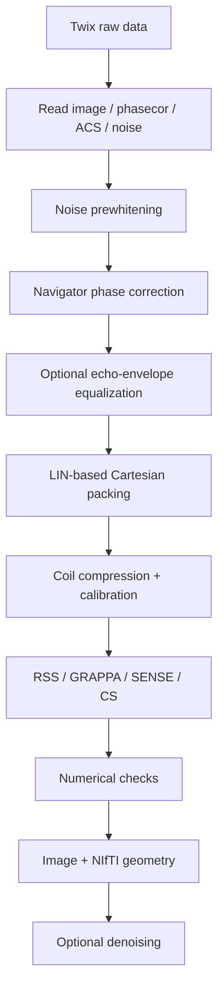

# Reconstruction

The repository includes a transparent MATLAB reconstruction for **conventional Cartesian 2D TSE Siemens Twix data**. Unlike a reconstruction-library package, this implementation exists primarily to make the sequence acquisition testable, inspectable and reproducible from raw data through image export.

The public entry point is

```matlab
result = recon_TSE2D(filename, Name, Value, ...)
```

[Source: `recon/matlab/recon_TSE2D.m`](https://github.com/BennyZhang-Codes/tse-pulseq-matlab/blob/vitepress-style/recon/matlab/recon_TSE2D.m)

::: warning Scope
The current offline path does not decode gSlider, does not provide a non-Siemens raw-data reader, and does not claim pixel-for-pixel equivalence with proprietary Siemens ICE reconstruction.
:::

## Processing pipeline



The ordering is deliberate: prewhitening establishes a common coil/noise basis before calibration; navigator corrections are applied before k-space packing; optional image-domain denoising occurs only after reconstruction.

## 1. Twix data input

`read_TSE2D_twix.m` uses external [mapVBVD](https://github.com/pehses/mapVBVD) to expose

- image data;
- `phasecor` navigators;
- PAT `refscan` data;
- compatible reference phase-correction information; and
- receive-noise data.

The pipeline tracks `LIN`, `SLC` and `SEG` so acquisitions can be mapped to PE rows, slices and TSE echoes. Siemens LIN is zero based on the sequence/platform side, while mapVBVD/MATLAB indices are one based. See [Siemens 7 T LIN & ICE](/phase-encoding-and-ice).

## 2. Receive-noise prewhitening

Let $\Psi$ be the complex receive-noise covariance. The implementation constructs a regularized inverse Hermitian square root $W_N$ such that

$$
W_N\Psi W_N^H\approx I.
$$

The same transform is applied to image, navigator and compatible calibration streams. This follows standard phased-array/noise normalization principles [[3]](/references#ref-3 "Roemer PB, Edelstein WA, Hayes CE, Souza SP, Mueller OM. The NMR phased array. Magn Reson Med. 1990;16:192-225.") [[4]](/references#ref-4 "Kellman P, McVeigh ER. Image reconstruction in SNR units: a general method for SNR measurement. Magn Reson Med. 2005;54:1439-1447.").

Noise data are not subjected to the image readout-cropping operation before covariance estimation, because such cropping can introduce sample correlations. If no usable noise scan is available, the code warns and falls back rather than silently claiming successful prewhitening.

Main options:

| Option | Default |
| --- | --- |
| `Prewhiten` | `true` |
| `NoiseShrinkage` | `0.02` |
| `NoiseEigenvalueFloor` | `1e-6` |

## 3. Navigator phase correction

The unencoded TSE navigator train is used to estimate relative phase against a reference echo. For slice $s$, echo $e$, coil $c$ and normalized readout coordinate $\kappa$,

$$
z_{s,e,c}(\kappa)
=
n_{s,e,c}(\kappa)n^*_{s,e_{\mathrm{ref}},c}(\kappa),
$$

and the implementation fits

$$
\arg z_{s,e,c}(\kappa)
\approx
\beta_{1,s,e,c}\kappa+\beta_{0,s,e,c}.
$$

The constant and readout-linear terms are then removed from compatible image/reference acquisitions before packing. This is a transparent repository model, not a clone of proprietary ICE filtering.

Main options:

| Option | Default |
| --- | --- |
| `PhaseCorrection` | `true` |
| `PhaseReferenceEcho` | `1` |
| `ComparePhaseCorrection` | `false` |

## 4. Optional echo-magnitude correction

The same navigator train can estimate a normalized echo envelope $A_{s,e}$. If explicitly enabled, the package can apply power-law or normalized Wiener-style regularized equalization before Cartesian packing.

This is an **optional user-selected preprocessing step**, not a mandatory definition of correct TSE reconstruction. RARE/FSE echo-modulation correction and Wiener demodulation have prior literature support [[16]](/references#ref-16 "Oshio K, Singh M. Correction of T2 distortion in multi-excitation RARE sequence. IEEE Trans Med Imaging. 1992;11:123-128.") [[17]](/references#ref-17 "Zhou X, Liang ZP, Cofer GP, et al. Reduction of ringing and blurring artifacts in fast spin-echo imaging. J Magn Reson Imaging. 1993;3:803-807.") [[18]](/references#ref-18 "Chen H, Avram H, Kaufman L, Hale J, Kramer D. T2 restoration and noise suppression of hybrid MR images using Wiener and linear prediction techniques. IEEE Trans Med Imaging. 1994;13:667-676.") [[19]](/references#ref-19 "Busse RF, Riederer SJ, Fletcher JG, Bharucha AE, Brandt KR. Interactive fast spin-echo imaging. Magn Reson Med. 2000;44:339-348."), but the present implementation uses one measured slice-level navigator envelope and should not be interpreted as tissue-specific T2/B1 inversion.

The API default is deliberately off:

```matlab
'EchoMagnitudeCorrection', false
```

See [Echo phase & magnitude correction](/guide/echo-corrections) for equations, gain regularization and implementation details.

## 5. Cartesian k-space packing

`pack_TSE2D_kspace.m` maps acquisitions to Cartesian rows using MDH LIN and averages repeated acquisitions assigned to the same encoded row. Imaging/reference views are handled so shared physical data are not unintentionally double weighted.

This step is part of the reconstruction model rather than merely file reshaping: an incorrect LIN-to-row assignment changes the echo-to-$k_y$ mapping and therefore TSE contrast/PSF behavior.

## 6. Reconstruction methods

`ReconstructionMethod` accepts

```text
auto
rss
grappa
sense
cs
```

| Method | Implementation in this package | Method basis |
| --- | --- | --- |
| `rss` | centered coil-wise IFFT + root-sum-of-squares | phased-array combination [[3]](/references#ref-3 "Roemer PB, Edelstein WA, Hayes CE, Souza SP, Mueller OM. The NMR phased array. Magn Reson Med. 1990;16:192-225.") |
| `grappa` | diagnostic PE-only GRAPPA using ACS; acquired rows are preserved | GRAPPA [[5]](/references#ref-5 "Griswold MA, Jakob PM, Heidemann RM, et al. Generalized autocalibrating partially parallel acquisitions (GRAPPA). Magn Reson Med. 2002;47:1202-1210.") |
| `sense` | regularized Cartesian SENSE with ESPIRiT sensitivity maps | SENSE [[6]](/references#ref-6 "Pruessmann KP, Weiger M, Scheidegger MB, Boesiger P. SENSE: sensitivity encoding for fast MRI. Magn Reson Med. 1999;42:952-962."); ESPIRiT [[7]](/references#ref-7 "Uecker M, Lai P, Murphy MJ, et al. ESPIRiT: an eigenvalue approach to autocalibrating parallel MRI. Magn Reson Med. 2014;71:990-1001.") |
| `cs` | same Cartesian multicoil model + isotropic TV + Haar-L1 | Sparse MRI [[8]](/references#ref-8 "Lustig M, Donoho D, Pauly JM. Sparse MRI: the application of compressed sensing for rapid MR imaging. Magn Reson Med. 2007;58:1182-1195."); Chambolle-Pock [[9]](/references#ref-9 "Chambolle A, Pock T. A first-order primal-dual algorithm for convex problems with applications to imaging. J Math Imaging Vis. 2011;40:120-145.") |

`auto` preserves convenience behavior for routine diagnostics. For scientific comparisons, choose a method explicitly.

## 7. Shared SENSE/CS encoding operator

After preprocessing and packing, iterative methods use

$$
A=PFS,
$$

where $S$ applies complex coil sensitivities, $F$ is the centered unitary Cartesian Fourier transform, and $P$ selects acquired PE rows.

This is the **implemented numerical reconstruction model**. The physical acquisition remains echo-dependent; before correction a more complete TSE expression is

$$
y_e=P_eFSD_ex+\varepsilon_e.
$$

The distinction is explained in [TSE signal & echo train](/theory/tse-echo-train).

### SENSE objective

The maintained SENSE path solves

$$
\min_x
\frac12\lVert Ax-y\rVert_2^2
+
\frac{\lambda_2}{2}\lVert x\rVert_2^2
$$

with conjugate gradients on the normal equations.

Defaults:

| Option | Default |
| --- | ---: |
| `SENSEIterations` | `50` |
| `SENSETolerance` | `1e-5` |
| `SENSETikhonov` | `1e-4` |

### Cartesian CS objective

The CS implementation solves

$$
\min_x
\frac12\lVert Ax-y\rVert_2^2
+
\lambda_{\mathrm{TV}}\lVert Dx\rVert_{2,1}
+
\lambda_W\lVert W_Hx\rVert_1,
$$

where $D$ is a 2D finite-difference operator and $W_H$ is an orthonormal Haar transform. The primal-dual iteration follows Chambolle-Pock [[9]](/references#ref-9 "Chambolle A, Pock T. A first-order primal-dual algorithm for convex problems with applications to imaging. J Math Imaging Vis. 2011;40:120-145.").

Defaults:

| Option | Default |
| --- | ---: |
| `CSIterations` | `250` |
| `CSTVWeight` | `0.006` |
| `CSWaveletWeight` | `0.0005` |
| `CSWaveletLevels` | `2` |

These are repository starting values, not universally optimal regularization parameters.

## 8. Coil compression and sensitivity maps

`prepare_TSE2D_sense_model.m` builds the common iterative model. Before sensitivity estimation it can call `compress_TSE2D_coils.m`, which forms an ACS coil covariance matrix, eigendecomposes it and retains the leading virtual-coil basis according to cumulative energy. This is a global PCA/array-compression strategy consistent with the MRI array-compression literature [[24]](/references#ref-24 "Buehrer M, Pruessmann KP, Boesiger P, Kozerke S. Array compression for MRI with large coil arrays. Magn Reson Med. 2007;57:1131-1139."). It is **not** geometric coil compression (GCC).

Main defaults:

| Option | Default |
| --- | ---: |
| `CoilCompressionEnergy` | `0.99` |
| `MaximumVirtualCoils` | `12` |
| `SensitivityMethod` | `'espirit'` |
| `ESPIRiTKernelSize` | `[6 6]` |
| `ESPIRiTSubspaceThreshold` | `0.02` |
| `ESPIRiTEigenvalueCrop` | `0.95` |

The native MATLAB ESPIRiT path currently returns a single map set [[7]](/references#ref-7 "Uecker M, Lai P, Murphy MJ, et al. ESPIRiT: an eigenvalue approach to autocalibrating parallel MRI. Magn Reson Med. 2014;71:990-1001.").

## 9. GRAPPA implementation

The diagnostic GRAPPA path operates only along PE. It calibrates from contiguous ACS, preserves every acquired row and synthesizes only missing rows. The default kernel uses four PE source lines and no readout neighbors.

| Option | Default |
| --- | ---: |
| `GRAPPA` | `true` |
| `GrappaKySourceCount` | `4` |
| `GrappaKxKernel` | `0` |
| `GrappaRegularization` | `1e-4` |

This is a transparent repository implementation of GRAPPA [[5]](/references#ref-5 "Griswold MA, Jakob PM, Heidemann RM, et al. Generalized autocalibrating partially parallel acquisitions (GRAPPA). Magn Reson Med. 2002;47:1202-1210."), not an ICE-equivalent kernel implementation.

## 10. Numerical checks

Before SENSE or CS iteration, the forward/adjoint inner-product identity is tested. A relative mismatch greater than `5e-5` stops the reconstruction.

The code also stores or checks

- calibration sizes and masks;
- finite outputs;
- solver residual histories;
- navigator fit/SNR diagnostics;
- ESPIRiT support/calibration diagnostics;
- coil-compression retained energy; and
- NIfTI geometry consistency.

These are implementation-consistency checks, not substitutes for independent/physical validation. See [Validation strategy](/validation/scientific-validation).

## 11. GPU and precision

SENSE/CS can use MATLAB GPU execution through

```matlab
'IterativeUseGPU', 'auto'
```

Accepted values are `true`, `false` or `'auto'`. RSS and diagnostic GRAPPA do not require the GPU path. Hardware and precision must be reported for performance comparisons.

## 12. Output and geometry

Important output options include

| Option | Default |
| --- | --- |
| `KeepKspace` | `false` |
| `OutputDir` | `''` |
| `SaveMat` | `true` when output is requested |
| `SaveFigures` | `true` when output is requested |
| `SaveNifti` | `false` |
| `OverwriteOutputs` | `false` |

The NIfTI path derives scanner-patient RAS geometry from Siemens MDH slice centers/quaternions when available and verifies reconstructed slice centers before writing.

## 13. Optional post-reconstruction denoising

NLM, BM3D, SANLM and TGV2 are provided as a **separate optional image-domain module**. They are not called automatically by `recon_TSE2D` and should be reported as post-processing when used. See [Optional denoising](/guide/denoising).

## Example: ordinary SENSE

```matlab
result = recon_TSE2D(twixFile, ...
    'MapVBVDPath', mapVBVDPath, ...
    'Prewhiten', true, ...
    'PhaseCorrection', true, ...
    'EchoMagnitudeCorrection', false, ...
    'ReconstructionMethod', 'sense', ...
    'SENSEIterations', 50, ...
    'SENSETolerance', 1e-5, ...
    'SENSETikhonov', 1e-4, ...
    'IterativeUseGPU', 'auto');
```

## Example: optional Wiener-style echo equalization

```matlab
result = recon_TSE2D(twixFile, ...
    'MapVBVDPath', mapVBVDPath, ...
    'Prewhiten', true, ...
    'PhaseCorrection', true, ...
    'EchoMagnitudeCorrection', true, ...
    'EchoMagnitudeMethod', 'wiener', ...
    'EchoMagnitudeAlpha', 0, ...
    'EchoMagnitudeLambda', 'auto', ...
    'EchoMagnitudeMaxGain', 2, ...
    'ReconstructionMethod', 'sense');
```

The second example demonstrates availability, not a universal recommendation.

## Source map

| Function | Role |
| --- | --- |
| [`recon_TSE2D.m`](https://github.com/BennyZhang-Codes/tse-pulseq-matlab/blob/vitepress-style/recon/matlab/recon_TSE2D.m) | pipeline and user-facing options |
| [`read_TSE2D_twix.m`](https://github.com/BennyZhang-Codes/tse-pulseq-matlab/blob/vitepress-style/recon/matlab/read_TSE2D_twix.m) | Twix/mapVBVD input |
| [`estimate_noise_whitener.m`](https://github.com/BennyZhang-Codes/tse-pulseq-matlab/blob/vitepress-style/recon/matlab/estimate_noise_whitener.m) | prewhitening |
| [`estimate_TSE_phasecor.m`](https://github.com/BennyZhang-Codes/tse-pulseq-matlab/blob/vitepress-style/recon/matlab/estimate_TSE_phasecor.m) | navigator model |
| [`apply_TSE_echomagcor.m`](https://github.com/BennyZhang-Codes/tse-pulseq-matlab/blob/vitepress-style/recon/matlab/apply_TSE_echomagcor.m) | optional echo-envelope gain |
| [`pack_TSE2D_kspace.m`](https://github.com/BennyZhang-Codes/tse-pulseq-matlab/blob/vitepress-style/recon/matlab/pack_TSE2D_kspace.m) | LIN-based packing |
| [`compress_TSE2D_coils.m`](https://github.com/BennyZhang-Codes/tse-pulseq-matlab/blob/vitepress-style/recon/matlab/utils/compress_TSE2D_coils.m) | global PCA coil compression |
| [`estimate_TSE2D_espirit.m`](https://github.com/BennyZhang-Codes/tse-pulseq-matlab/blob/vitepress-style/recon/matlab/utils/estimate_TSE2D_espirit.m) | sensitivity estimation |
| [`recon_TSE2D_GRAPPA.m`](https://github.com/BennyZhang-Codes/tse-pulseq-matlab/blob/vitepress-style/recon/matlab/recon_TSE2D_GRAPPA.m) | PE-GRAPPA |
| [`recon_TSE2D_SENSE.m`](https://github.com/BennyZhang-Codes/tse-pulseq-matlab/blob/vitepress-style/recon/matlab/recon_TSE2D_SENSE.m) | SENSE |
| [`recon_TSE2D_CS.m`](https://github.com/BennyZhang-Codes/tse-pulseq-matlab/blob/vitepress-style/recon/matlab/recon_TSE2D_CS.m) | TV/Haar-L1 CS |

For exact code/software attribution, see [Dependencies & method provenance](/reference/provenance). For frozen comparison settings, see [Reconstruction protocol](/validation/reconstruction-protocol).

## Current limitations

The MATLAB reconstruction does not currently implement

- gSlider decoding;
- non-Siemens raw-data readers;
- partial Fourier;
- SMS;
- non-Cartesian trajectories;
- multiple ESPIRiT map sets; or
- proprietary Siemens raw-data scaling, adaptive coil combination and image filtering.
