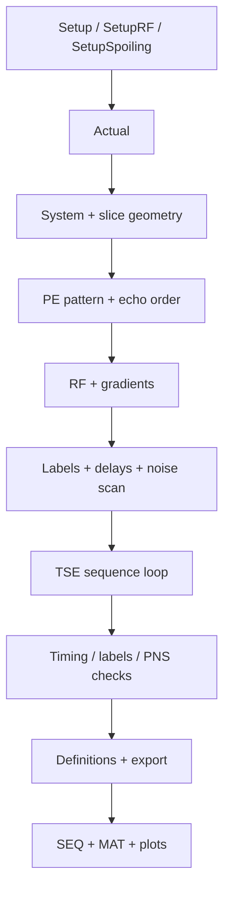
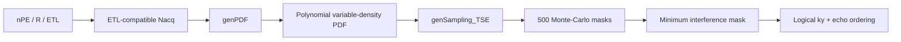

# Sequence implementation

`tse-pulseq-matlab` is first and foremost an **open-source Pulseq sequence implementation**. The two maintained entry points are [`TSE_2D.m`](https://github.com/BennyZhang-Codes/tse-pulseq-matlab/blob/vitepress-style/TSE_2D.m) and [`TSE_2D_gSlider.m`](https://github.com/BennyZhang-Codes/tse-pulseq-matlab/blob/vitepress-style/TSE_2D_gSlider.m). Both construct Cartesian 2D RARE/TSE echo trains [[1]](/references#ref-1 "Hennig J, Nauerth A, Friedburg H. RARE imaging: a fast imaging method for clinical MR. Magn Reson Med. 1986;3:823-833.") through Pulseq [[2]](/references#ref-2 "Layton KJ, Kroboth S, Jia F, et al. Pulseq: a rapid and hardware-independent pulse sequence prototyping framework. Magn Reson Med. 2017;77:1544-1552.").

This page explains **what the sequence code does and where each implementation comes from**. Signal-model details are linked only where they help interpret an implementation choice.

## Entry points and build pipeline

The entry scripts expose three user-facing configuration structures:

- `Setup` — scanner profile, geometry, timing, acceleration, ordering and sequence behavior;
- `SetupRF` — RF pulse family, duration, time-bandwidth product and phase;
- `SetupSpoiling` — crusher/spoiler cycles, reference length and waveform constraints.

`Setup` is copied into `Actual`. Preparation functions then resolve the requested protocol into raster-compatible Pulseq RF, gradient, ADC, delay and label objects.



The main source mapping is:

| Stage | Main implementation |
| --- | --- |
| system limits | `prep/prep_System.m` |
| slice positions | `prep/prep_SlicePositions.m` |
| PE / acceleration order | `prep/prep_PE3DOrder.m` and mode-specific helpers |
| excitation / refocusing / inversion | `prep/prep_Excitation.m`, `prep/prep_Refocusing.m`, `prep/prep_Inversion.m` |
| spoilers / readout gradients | `prep/prep_SpoilingArea.m`, `prep/prep_Gradient_GR.m`, `prep/prep_Gradient_Block.m` |
| acquisition labels | `prep/prep_Label.m` |
| conventional TSE loop | `prep/prep_Seqloop.m`, `prep/prep_Seqloop_IR.m` |
| gSlider loop | `prep/prep_Seqloop_gSlider.m`, `prep/prep_Seqloop_IR_gSlider.m` |
| validation | `check/check_Timing.m`, `check/check_Label.m`, `check/check_PNS.m` |
| exported definitions | `prep/prep_Definition.m` |

## Geometry and orientation

Core geometry is controlled by

```matlab
Setup.fovRO
Setup.fovPE
Setup.nRO
Setup.nPE
Setup.nSlice
Setup.SliceThickness
Setup.SliceGap
```

The nominal in-plane voxel sizes are `fovRO/nRO` and `fovPE/nPE`. These settings also propagate into readout/PE gradient areas, slice selection and spoiler reference lengths.

The current maintained examples are non-oblique and explicitly map logical RO/PE/slice axes to physical gradient axes:

```matlab
Setup.AxisRO = 'x';
Setup.AxisPE = 'y';
Setup.Axis3D = 'z';
```

`Setup.SignCorr` controls gradient polarity. This mapping is an implementation choice of the current examples, not a Pulseq requirement.

## Echo train and timing

The principal TSE timing parameters are

```matlab
Setup.nEcho
Setup.TE1
Setup.TEeff
Setup.TR
Setup.roDuration
```

The implementation rasterizes RF, ADC and gradient timing before assembling the echo train. `TEeff` is used by the PE-order generator to place the desired echo at physical $k_y=0$ when the discrete acquisition permits it. The consequence of this echo-to-$k_y$ mapping is described in [TSE signal and echo train](/theory/tse-echo-train) and [Phase encoding & acceleration](/theory/phase-encoding).

Changing RF duration, readout duration, ETL, crushers or inversion timing can make the requested TE/TR infeasible. Timing must therefore be rechecked after protocol changes; passing a timing check does **not** establish RF safety or image quality.

## RF implementation and pulse provenance

The current conventional TSE example uses a sinc excitation generated by Pulseq and an SLR refocusing pulse. The SLR refocusing and inversion pulse banks are not opaque hand-tuned arrays: they are generated offline by [`prep/pulse/RF_pulse.ipynb`](https://github.com/BennyZhang-Codes/tse-pulseq-matlab/blob/vitepress-style/prep/pulse/RF_pulse.ipynb) with SigPy RF's `slr.dzrf`, following the Shinnar-Le Roux design framework [[20]](/references#ref-20 "Pauly JM, Le Roux P, Nishimura DG, Macovski A. Parameter relations for the Shinnar-Le Roux selective excitation pulse design algorithm. IEEE Trans Med Imaging. 1991;10:53-65."). The generated `.mat` pulse banks are loaded by the MATLAB sequence code, so SigPy is a **pulse-generation/provenance dependency**, not a runtime dependency when using the bundled pulse files.

The gSlider excitation bank is generated by the same notebook with SigPy RF's `dz_gslider_rf`, based on the gSlider RF-encoding method [[21]](/references#ref-21 "Setsompop K, Fan Q, Stockmann J, et al. High-resolution in vivo diffusion imaging of the human brain with generalized slice dithered enhanced resolution: simultaneous multislice (gSlider-SMS). Magn Reson Med. 2018;79:141-151."). The repository's gSlider-TSE implementation is documented separately [[14]](/references#ref-14 "Zhang J, Wu Y, Xue R, Zhuo Y, Zhang Z. gSlider-TSE for high-resolution isotropic T2-weighted imaging with high contrast and high SNR. Proc Intl Soc Magn Reson Med. 2024; Program #3256.").

Optional VERSE processing is provided through the `VERSE/` Git submodule. That submodule records its upstream code lineage and uses the time-optimal VERSE framework of Lee et al. [[23]](/references#ref-23 "Lee D, Lustig M, Grissom WA, Pauly JM. Time-optimal design for multidimensional and parallel transmit variable-rate selective excitation. Magn Reson Med. 2009;61:1471-1479."). See [Dependencies & method provenance](/reference/provenance) for the exact attribution chain.

## Phase encoding, PI and CS

Acceleration is selected with

```matlab
Setup.AccelerationMode = 'PI';  % or 'CS'
Setup.R = 2;
```

The two paths are intentionally different:

- **PI** uses a regular undersampled PE lattice plus contiguous ACS/reference lines suitable for GRAPPA/SENSE-style reconstruction;
- **CS** uses a variable-density random PE pattern intended for offline iterative reconstruction.

### CS sampling implementation

The CS pattern is **one-dimensional variable-density phase-encoding sampling**, not Poisson-disc sampling. The implementation is derived from Michael Lustig's SparseMRI sampling utilities associated with Sparse MRI [[8]](/references#ref-8 "Lustig M, Donoho D, Pauly JM. Sparse MRI: the application of compressed sensing for rapid MR imaging. Magn Reson Med. 2007;58:1182-1195."). The source files `prep/CS/genPDF.m` and `genSampling.m` retain the header `(c) Michael Lustig 2007`; `genSampling_TSE.m` is the repository's TSE-specific adaptation.



`prep_PE3DOrder_CS.m` first forces the acquired line count to an integer multiple of the echo-train length,

$$
N_{\mathrm{acq}}
=
\operatorname{round}\!\left(\frac{N_{\mathrm{PE}}}{R N_E}\right)N_E,
$$

then calls `genPDF` with the configured polynomial power `Setup.p` and fully sampled center-radius parameter `Setup.r`. `genSampling_TSE` generates Monte-Carlo candidates and selects the pattern with the lowest maximum off-center interference metric. See [Phase encoding & acceleration](/theory/phase-encoding) for the exact mapping into PE/echo order.

## gSlider and TRAPS

`TSE_2D_gSlider.m` supports gSlider excitation and an optional TRAPS-style refocusing schedule:

```matlab
Setup.TRAPS = 'on';
SetupRF.typeEx = 'gSlider';
```

`utils/fliptraps.m` implements the variable-refocusing schedule used by this repository. It is documented as a **repository implementation of the TRAPS concept**, not as original code distributed by the TRAPS authors. The method basis is Hennig et al. [[22]](/references#ref-22 "Hennig J, Weigel M, Scheffler K. Multiecho sequences with variable refocusing flip angles: optimization of signal behavior using smooth transitions between pseudo steady states (TRAPS). Magn Reson Med. 2003;49:527-535.").

See [gSlider-TSE & TRAPS](/guide/gslider-traps) for the concrete encoding/repetition behavior and current reconstruction limitation.

## Crushers and spoilers

Spoiler strength is parameterized as dephasing cycles over a physical reference length rather than a fixed gradient area. For example:

```matlab
SetupSpoiling.RefocusingCrusher.Cycles = 4;
SetupSpoiling.RefocusingCrusher.Reference = 'Slice';
```

with

$$
A_{\mathrm{spoil}}
=
\frac{N_{\mathrm{cycles}}}{L_{\mathrm{reference}}}.
$$

This lets spoiler area scale with slice/slab thickness or resolution. The generated waveform is still checked against the integer gradient raster, amplitude, slew and endpoint constraints.

## Platform-specific integration

The logical Pulseq acquisition is designed separately from scanner-specific metadata. The currently implemented system profiles are Siemens 7 T `Terra-XJ` and `Terra-XR`; Siemens LIN metadata, ICE definitions and `.asc` PNS models belong to the **current adapter**, not to the TSE method itself.

For this boundary, see [Platform integration](/platform-integration) and [Siemens 7 T LIN & ICE](/phase-encoding-and-ice).

## Exported outputs

After checks and `prep_Definition`, the sequence entry scripts write

```text
seq/<sequence-name>.seq
seq/<sequence-name>.mat
```

The MAT file stores both the requested `Setup` and resolved `Actual` structures. Keep the `.seq`, MAT file, repository revision and submodule revisions together for reproducibility.

## Implementation provenance

All external method/code relationships used on this page are centralized in [Dependencies & method provenance](/reference/provenance). That page should be updated whenever a new sampling routine, RF generator, toolbox, reconstruction method or third-party code path is introduced.
