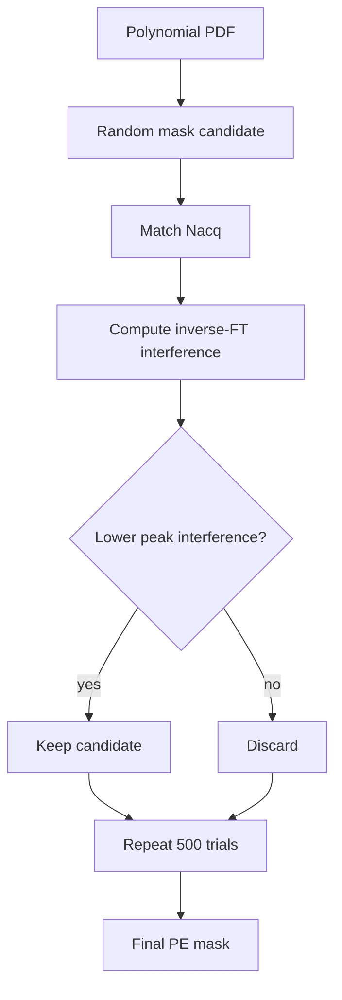

# Phase encoding & acceleration

This page documents the **implemented phase-encoding pipeline**: how logical $k_y$ locations are selected, how they are assigned to the TSE echo train, and when platform-specific line metadata are introduced.

## Logical echo-to-$k_y$ mapping

For an echo train of length $N_E$, let $e(k_y)$ denote the echo used for a phase-encoding position. The TSE echo envelope therefore appears across phase encoding as

$$
w(k_y)=E_{e(k_y)}.
$$

The maintained ordering modes are

```text
Linear
CentricFull
CentricHalf
```

The requested effective echo is approximately

$$
e_0
=
\max\!\left[
\operatorname{round}\!\left(\frac{T_{E,\mathrm{eff}}}{T_{E,1}}\right),1
\right],
$$

and the ordering logic shifts the train so that

$$
e(k_y=0)\approx e_0.
$$

This is a discrete implementation constraint: matrix size, acceleration and ETL can prevent an arbitrary continuous `TEeff` from mapping exactly to a realizable echo.

## Acquisition-order pipeline


The ordering matters conceptually. **Siemens LIN is not the acquisition model**; it is one currently implemented metadata mapping of an already defined logical acquisition.

## Parallel imaging path

For `AccelerationMode='PI'`, the repository constructs a regular undersampled PE lattice and a contiguous ACS region. The implementation tracks separately:

- encoded matrix size and physical $k_y=0$;
- acceleration factor $R$;
- acquired imaging lines;
- reference-only lines;
- image-plus-reference ACS lines;
- echo assignment for every acquired PE position.

The sequence-side sampling contract is compatible with conventional parallel-imaging reconstruction such as GRAPPA [[5]](/references#ref-5 "Griswold MA, Jakob PM, Heidemann RM, et al. Generalized autocalibrating partially parallel acquisitions (GRAPPA). Magn Reson Med. 2002;47:1202-1210.") and SENSE [[6]](/references#ref-6 "Pruessmann KP, Weiger M, Scheidegger MB, Boesiger P. SENSE: sensitivity encoding for fast MRI. Magn Reson Med. 1999;42:952-962."). The current Siemens adapter subsequently maps the logical rows into its zero-based LIN convention; see [Siemens 7 T LIN & ICE](/phase-encoding-and-ice).

## Compressed-sensing acquisition path

The CS sampling code is derived from Michael Lustig's SparseMRI sampling utilities associated with Sparse MRI [[8]](/references#ref-8 "Lustig M, Donoho D, Pauly JM. Sparse MRI: the application of compressed sensing for rapid MR imaging. Magn Reson Med. 2007;58:1182-1195."). `prep/CS/genPDF.m` and `genSampling.m` retain `(c) Michael Lustig 2007` in their source headers; `genSampling_TSE.m` is the repository-specific TSE adaptation.

::: info Sampling type
The implemented CS pattern is **one-dimensional polynomial variable-density sampling along phase encoding**. It is not a two-dimensional Poisson-disc mask.
:::

### 1. ETL-compatible acquired-line count

`prep_PE3DOrder_CS.m` chooses

$$
N_{\mathrm{acq}}
=
\operatorname{round}\!\left(\frac{N_{\mathrm{PE}}}{R N_E}\right)N_E,
$$

so that the acquired PE count is an integer multiple of the echo-train length.

### 2. Polynomial variable-density PDF

The code calls

```matlab
[pdf,~] = genPDF(nPE,p,Nacq/nPE,2,r,1);
```

where `p = Setup.p` controls the polynomial falloff and `r = Setup.r` specifies the fully sampled central-radius parameter used by the Lustig-style PDF generator.

### 3. Monte-Carlo interference minimization

`genSampling_TSE(pdf,500,0.3,nAcq)` draws random masks according to the PDF. For each candidate it evaluates the off-center interference of

$$
\mathcal F^{-1}\!\left\{\frac{M(k_y)}{p(k_y)}\right\},
$$

and retains the candidate with the lowest peak off-center magnitude. The TSE adaptation additionally targets the explicit `nAcq` count needed by the echo-train grouping.



The selected mask is then converted back to logical signed $k_y$ positions and passed into the same echo-ordering framework used by the rest of the sequence.

## Effective TE and k-space center

Central k-space strongly influences image contrast. In TSE, mapping a selected echo to $k_y=0$ therefore makes `TEeff` an implementation parameter connecting timing to the PE order. The RARE/TSE signal itself remains echo-dependent [[1]](/references#ref-1 "Hennig J, Nauerth A, Friedburg H. RARE imaging: a fast imaging method for clinical MR. Magn Reson Med. 1986;3:823-833.").

`TEeff` should not be interpreted as a complete tissue model. Refocusing angle, $T_1/T_2$, stimulated echoes, B1 and slice profile can all alter the echo envelope. See [TSE signal & echo train](/theory/tse-echo-train).

## Platform metadata and indexing

For the currently validated Siemens PI path,

$$
\mathrm{LIN}_{\mathrm{Siemens}}
=
\mathrm{Lin}_{\mathrm{mapVBVD}}-1.
$$

The left side is zero-based scanner metadata; the right side is MATLAB/mapVBVD one-based indexing. This difference is an index convention only and must not be confused with a one-line physical k-space shift.

CS acquisitions should not inherit Siemens PI/online-GRAPPA assumptions unless a specific platform adapter defines that behavior.

## Source map

| Role | Source |
| --- | --- |
| overall PE dispatch/order | [`prep_PE3DOrder.m`](https://github.com/BennyZhang-Codes/tse-pulseq-matlab/blob/vitepress-style/prep/prep_PE3DOrder.m) |
| CS order | [`prep_PE3DOrder_CS.m`](https://github.com/BennyZhang-Codes/tse-pulseq-matlab/blob/vitepress-style/prep/prep_PE3DOrder_CS.m) |
| variable-density PDF | [`prep/CS/genPDF.m`](https://github.com/BennyZhang-Codes/tse-pulseq-matlab/blob/vitepress-style/prep/CS/genPDF.m) |
| Monte-Carlo sampling | [`prep/CS/genSampling.m`](https://github.com/BennyZhang-Codes/tse-pulseq-matlab/blob/vitepress-style/prep/CS/genSampling.m) |
| TSE-adapted sampling | [`prep/CS/genSampling_TSE.m`](https://github.com/BennyZhang-Codes/tse-pulseq-matlab/blob/vitepress-style/prep/CS/genSampling_TSE.m) |

For code-level attribution, see [Dependencies & method provenance](/reference/provenance).
