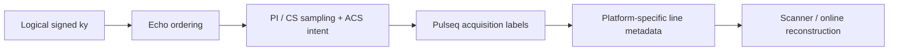

# Phase encoding and effective TE

The phase-encoding design is expressed first in **logical $k_y$ coordinates**. Scanner-specific line numbering is applied only after the acquisition order has been defined.

## Logical echo-to-$k_y$ mapping

For an echo train of length $N_E$, let $e(k_y)$ denote the echo used to acquire a phase-encoding location. The TSE modulation sampled across phase encoding is then

$$
w(k_y)=E_{e(k_y)}.
$$

The maintained `PEMode` choices are:

```text
Linear
CentricFull
CentricHalf
```

The requested effective echo selects the desired center echo

$$
e_0
=
\max\!\left(
\operatorname{round}\!\left(\frac{T_{E,\mathrm{eff}}}{T_{E,1}}\right),
1
\right),
$$

and the order is shifted so that

$$
e(k_y=0)\approx e_0.
$$

The equality can be constrained by the discrete echo train, matrix size, acceleration pattern, and ordering mode.

## Sampling pattern versus metadata

The logical phase-encoding pattern answers physical acquisition questions:

- which $k_y$ locations are acquired;
- in which echo they are acquired;
- which lines are imaging lines;
- which lines belong to ACS/reference calibration;
- which lines are omitted for acceleration.

A platform-specific metadata layer then maps those logical lines into whatever index convention the target interpreter or online reconstruction requires.



This order of operations is important. Siemens LIN is **not** the definition of the acquisition; it is one current platform mapping of the logical acquisition.

## Parallel imaging

For `AccelerationMode='PI'`, the sequence uses a regular accelerated imaging lattice together with a contiguous ACS/reference region. The design must preserve:

- full encoded PE matrix size;
- physical k-space center;
- acceleration factor $R$;
- regular imaging lattice;
- ACS location and width;
- distinction between imaging, reference-only, and image-plus-reference lines.

The current Siemens 7 T integration subsequently converts this into its zero-based LIN convention. That mapping is documented separately in [Siemens 7 T LIN & ICE](/phase-encoding-and-ice).

## Compressed sensing

For `AccelerationMode='CS'`, the sampling order is intended for offline iterative reconstruction and is kept separate from the PI/ICE path.

Do not silently apply Siemens PI LIN assumptions to a CS acquisition. The CS pattern can contain its own ordering/sentinel behavior and should be interpreted by the offline reconstruction model rather than by an online GRAPPA contract unless a future platform adapter explicitly defines such behavior.

## Effective TE and central k-space

Central k-space carries strong image-energy and contrast weighting. For TSE, placing a chosen echo at $k_y=0$ therefore couples `TEeff` to image contrast.

However, effective TE is not a complete tissue model. The signal at the center echo depends on refocusing flip angles, T1/T2, stimulated echoes, B1, slice profile, crushers, and other sequence details. Use `TEeff` as a **k-space placement parameter** and interpret tissue contrast through the actual echo train.

## Siemens LIN versus mapVBVD indexing

In the currently validated Siemens PI path, exported LIN metadata are zero-based. After Twix data are loaded through MATLAB/mapVBVD, line indices are one-based.

Therefore, for the same physical row,

$$
\mathrm{LIN}_{\mathrm{Siemens}}
=
\mathrm{Lin}_{\mathrm{mapVBVD}}-1.
$$

This one-sample difference is purely an index-base convention. It is a common source of apparent center-line or ACS mismatches when comparing sequence definitions directly with MATLAB counters.

## What to inspect after changing PE settings

After modifying `PEMode`, `TEeff`, `nEcho`, `R`, or ACS width:

1. verify that physical $k_y=0$ is associated with the intended echo;
2. inspect the logical sampling pattern before platform conversion;
3. confirm that PI imaging lines form the intended regular lattice;
4. confirm ACS continuity and width;
5. verify exported platform metadata independently of the logical order;
6. compare reconstructed blur, ringing, and phase-direction artifacts on matched phantom data.
